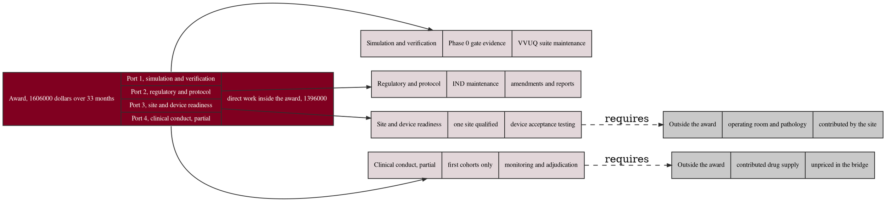

# Figure 19 - Where each dollar of the award lands

**Type.** graphviz-type, record with ports. **Section.** §6, Funding Proposals.
**Perspective.** *The award drawn as a record whose ports each terminate in a
named work package, including the two packages the award does not reach, so a
funder can see the boundary of what is being asked for.* No other figure in this
paper routes money; Figure 18 tabulates the totals under two overhead regimes
and Figure 20 draws the machinery that produced the applications.

**Caption (2 balanced lines, 76 and 75 characters, numbered as printed).**

```
Figure 19. The award as a four-port record, the work package each port pays,
and the two packages that sit outside the award and are funded another way.
```

## DOT source



## TikZ construction table

Absolute coordinates. Canvas 14.8 by 8.6 cm. One port record on the left, four
work package records in the center, two contributed records on the right.

| Element | Style token | Placement |
|:--|:--|:--|
| Award record header | `gvcellh`, width 46 mm, height 0.52 cm | x = 0, y = 0 |
| Four port cells | `gvcellk`, width 46 mm, height 0.56 cm | x = 0, y = -0.52, -1.08, -1.64, -2.20 |
| Award record footer | `gvcellh`, width 46 mm | x = 0, y = -2.76 |
| Port anchors | Named coordinates on the record's east edge | At the vertical center of each port cell |
| Work package records | 3-field records, `gvcellh` header plus two `gvcells`, width 40 mm | x = 6.15, y = -0.10, -1.90, -3.70, -5.50; pitch 1.80 cm |
| Contributed records | 3-field records, `gvcellh` header plus two `gvcellg`, width 40 mm | x = 11.35, y = -3.70 and -5.50 |
| Port edges, 4 | `gvedgeb`, 0.75 pt | From each port anchor to its work package record's west anchor |
| Requirement edges, 2 | `gvedged` | From a work package record's east anchor to a contributed record's west anchor |
| Edge labels | `gvedge` label, white fill | Midpoint of each requirement edge |
| Firewall rule | Charcoal, 0.8 pt, dashed | Vertical at x = 10.85, labeled `firewall, federal money below` |
| Bridge strip | `gvboxm`, `text width=54mm` | x = 0, y = -6.85 |
| Ratio strip | `gvboxs`, `text width=40mm` | x = 8.20, y = -6.85 |
| In-figure note | `pnote` | x = 0, y = -7.75, `text width=140mm` |

The four port cells share one 0.56 cm height, so the four edges leave the award
record at four evenly spaced anchors and their fan is regular. The two
contributed records sit right of the firewall rule and take the neutral fill,
which is the only place in the figure where a record is not burgundy or pale
burgundy.

## Structure table

| Port | Work package | Inside the award | What it buys |
|:--|:--|:--|:--|
| 1 | Simulation and verification | Yes | Phase 0 gate evidence and VVUQ suite maintenance |
| 2 | Regulatory and protocol | Yes | IND maintenance, amendments, and required reports |
| 3 | Site and device readiness | Yes | One site qualified and device acceptance testing |
| 4 | Clinical conduct, partial | Partial | First cohorts only, with monitoring and adjudication |
| none | Contributed drug supply | No | Unpriced in the capital bridge |
| none | Operating room and pathology | No | Contributed by the site, unpriced |

The award is 1,606,000 dollars over 33 months, of which 1,396,000 is direct
work; 2,104,000 dollars of the five-year direct program sits outside it.
Federal money sits below a firewall, contributed drug, operating room and
pathology sit unpriced in the middle, and 5,900,000 dollars of private capital
sits above, raised only after a milestone closes, which is 3.67 to one on cash
alone against an annexed target of at least 3 to 1.

## Edge routing

Six edges. The four port edges leave four anchors 0.56 cm apart and enter four
work package records 1.80 cm apart, so they fan monotonically and cannot cross;
the widest is 18 degrees from horizontal. The two requirement edges are
horizontal runs of 1.35 cm at y = -3.70 and y = -5.50, in separate bands, and
each crosses the firewall rule exactly once, which is the point: a work package
inside the award depends on a contribution outside it. No edge passes through a
record field, because every edge leaves and enters at a record's outer edge.

## Repository sources

- `funding/capitalization-plan/final-capital/publication/LaTeX Source Files.zip` - the award total, the direct work inside and outside it, the four-layer budget, the firewall, the contributed items, and the 3.67 to one bridge ratio
- `funding/pdac-funding-applications/final-apply/publication/LaTeX Source Files.zip` - application 05, the SBIR mechanism this award is drawn under
- `funding/RFA-RM-27-001-v2/LaTeX Source Files.zip` - the budget, milestones and sustainability section the port structure is checked against
- `trial-protocol/final-protocol/publication/LaTeX Source Files.zip` - the Phase 0 gate evidence port 1 pays for
