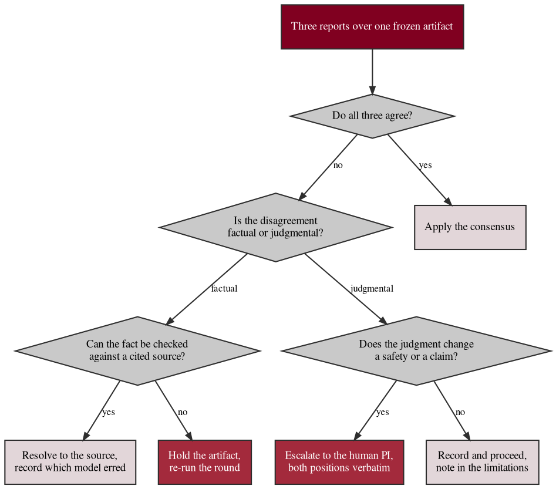

# Figure 24 - What happens when the reviewers disagree

**Type.** graphviz-type, decision tree. **Section.** §7, AI Peer Review.
**Perspective.** *The five terminal dispositions a disagreement between model
reviewers can reach, read from one root, so the claim that disagreement is
recorded rather than averaged is checkable.* No other figure in this paper draws
the resolution path; Figure 23 draws the concurrency that produces the reports,
Figure 21 the timing, and Figure 22 the economics.

**Caption (2 balanced lines, 69 and 65 characters, numbered as printed).**

```
Figure 24. One disagreement from three model reports to five terminal
dispositions, of which none is an average and only one is silent.
```

## DOT source



## TikZ construction table

Absolute coordinates. Canvas 15.0 by 9.0 cm. Four ranks top to bottom at a
uniform separation, because a decision tree is read from its root.

| Element | Style token | Placement |
|:--|:--|:--|
| Rank separation | 2.05 cm | Uniform between rank 0 and rank 4 |
| Root | `gvboxk`, `text width=52mm`, `line width=0.9pt` | Rank 0, x = 7.50, y = 0 |
| Decision 1 | `mmdec`, `aspect=2.0`, `text width=22mm` | Rank 1, x = 7.50, y = -2.05 |
| Terminal 1 | `gvboxs`, `text width=30mm` | Rank 2, x = 1.85, y = -4.10 |
| Decision 2 | `mmdec`, `aspect=2.0`, `text width=24mm` | Rank 2, x = 9.35, y = -4.10 |
| Decision 3 | `mmdec`, `aspect=2.0`, `text width=24mm` | Rank 3, x = 6.05, y = -6.15 |
| Decision 4 | `mmdec`, `aspect=2.0`, `text width=24mm` | Rank 3, x = 12.65, y = -6.15 |
| Terminal 2 | `gvboxs`, `text width=30mm` | Rank 4, x = 3.55, y = -8.20 |
| Terminal 5 | `gvboxm`, `text width=30mm` | Rank 4, x = 7.35, y = -8.20 |
| Terminal 3 | `gvboxm`, `text width=30mm` | Rank 4, x = 11.15, y = -8.20 |
| Terminal 4 | `gvboxs`, `text width=30mm` | Rank 4, x = 14.15, y = -8.20 |
| Edges | `gvedge`, terminal edges to t3 and t5 `gvedgeb` at 0.75 pt | Nine edges, all descending |
| Edge labels | `gvedge` label, white fill, `inner sep=1.5pt` | Midpoint of each edge |
| Disposition legend | `gvboxg`, `text width=44mm` | x = 0.35, y = -6.15, in the empty left quadrant of rank 3 |
| In-figure note | `pnote` | x = 0, y = -9.45, `text width=142mm` |

The tree is deliberately asymmetric: the left branch terminates in one step and
the right branch in three, because agreement is the common case and should cost
the reader one glance, while disagreement is the case the figure exists to
document.

## Structure table

| Disposition | Reached when | Recorded as |
|:--|:--|:--|
| Apply the consensus | All three reports agree | The correction, with the round number |
| Resolve to the source, record which model erred | Factual disagreement checkable against a cited source | The source, the resolution, and the erring model |
| Escalate to the human PI, both positions verbatim | Judgmental disagreement that changes a safety statement or a claim | Both positions in full, then the PI decision |
| Record and proceed, note in the limitations | Judgmental disagreement that changes neither | A limitations entry naming the open question |
| Hold the artifact, re-run the round | Factual disagreement that cannot be checked against any source | A hold, then a fresh round over the same frozen artifact |

None of the five dispositions averages the reports, and only one, `record and
proceed`, leaves the disagreement without an action. Two of the five, escalate
and hold, stop the artifact from progressing at all, which is why both are drawn
in the mid burgundy fill.

## Edge routing

Nine edges, all descending, none crossing a sibling subtree. The root to
decision 1 edge is vertical. Decision 1 fans left to terminal 1 and right to
decision 2, at 38 and 34 degrees from vertical, diverging monotonically.
Decision 2 fans to decisions 3 and 4 at 58 and 55 degrees, and the two subtrees
occupy disjoint horizontal spans, x = 3.05 to 8.35 for decision 3's children and
x = 9.85 to 15.00 for decision 4's, separated by a 1.50 cm corridor at x = 9.10
that carries no edge. Every rank 3 to rank 4 edge is within a 2.50 cm horizontal
offset and drops 2.05 cm, so no edge is shallower than 39 degrees and none
passes near a node it is not attached to. Edge labels sit at each edge's
midpoint with a white fill.

## Repository sources

- `new-trial-system/inputs/AI_Peer_Review_Acceleration_of_LLM_Generated_Glioblastoma_Clinical_Trial_Patient_Matching_ML__FDA_ICH_ISO__and_FastAPI.zip` - the triple review, the consensus recommendation, and the recorded divergence in the three regulatory analysts' scores of 8.0, 9.1 and 9.1 out of 10
- `funding/RFA-RM-27-001-v2/LaTeX Source Files.zip` - the requirement that disagreements be documented for accountable human resolution and approval, and that the human PI retain final authority
- `funding/capitalization-plan/final-capital/publication/LaTeX Source Files.zip` - the `gv*` vocabulary adapted here
