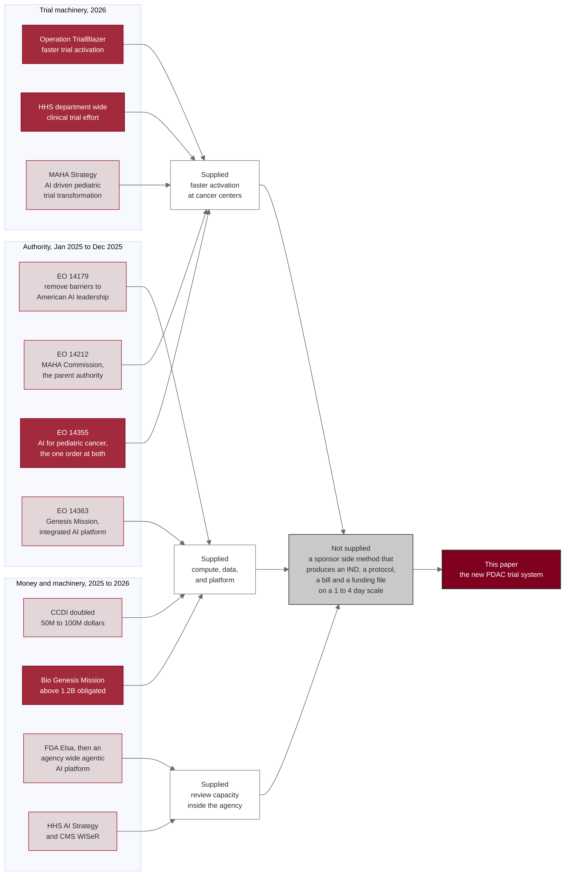

# Figure 1 - Eleven Federal actions, one unmet capability

**Type.** mermaid-type, `flowchart LR`. **Section.** §1, Introduction.
**Perspective.** *Which capability the 2025 to 2026 Federal AI and cancer
program creates, and which single capability it does not create, so that the
demand this paper's system answers is stated before the system is described.*
No other figure in this paper reads the policy record; Figure 2 scores the prior
system against the new one but assumes the demand has already been established,
and Figure 22 compares review economics without reference to any statute.

**Caption (2 balanced lines, 72 and 74 characters, numbered as printed).**

```
Figure 1. Eleven Federal AI and cancer actions from January 2025 to July
2026, the three capabilities they supply, and the one they leave unfilled.
```

## Mermaid source



## TikZ construction notes

Absolute coordinates throughout, so adding an element in stage 7 or stage 8
moves nothing already placed. Canvas 15.0 by 8.6 cm, drawn left to right in
five columns.

| Element | Style token | Placement |
|:--|:--|:--|
| Authority cluster title | `mmlanetitle` | Anchored south west on the cluster, 1.3 mm above the frame |
| A1 to A4 | `mmsoft`, A3 `mmmid`, `text width=27mm` | Column 0, x = 0, y = 3.15, 1.65, 0.15, -1.35; pitch 1.50 cm |
| Money cluster, M1 to M4 | `mmsoft`, M2 `mmmid`, `text width=27mm` | Column 1, x = 4.10, y = 3.15, 1.65, 0.15, -1.35; same pitch |
| Trials cluster, T1 to T3 | `mmmid` for T1 and T2, `mmsoft` for T3 | Column 2, x = 8.20, y = 2.40, 0.90, -0.60; pitch 1.50 cm |
| Three cluster frames | `mmlane`, `fit` each column | `inner sep=6pt`; columns clear each other by 13 mm |
| C1, C2, C3 | `mmin`, `text width=25mm` | Column 3, x = 11.85, y = 2.40, 0.55, -1.30; pitch 1.85 cm |
| GAP | `mmgrayd`, `text width=33mm`, `minimum height=15mm` | Column 4, x = 15.00, y = 0.55 |
| SYS | `mmgoal`, `text width=33mm` | Column 4, x = 15.00, y = -2.55, directly below GAP |
| Cluster to capability edges | `mmedge` | Eleven edges, all left to right, no bend needed |
| Capability to gap edges | `mmedged` | Three edges converging on GAP west anchor |
| Gap to system edge | `mmedgeb`, line width 1.1 pt | The only heavy edge on the canvas |
| In-figure note | `pnote` | x = 0, y = -4.05, `text width=142mm` |

The three source clusters are drawn at one pitch, 1.50 cm, and the capability
column at another, 1.85 cm, so the eye reads sources and consequences as two
different kinds of object. The gap node is the only Mist Gray fill on the
canvas and is one third wider than any node beside it, because it is the
figure's subject.

## Edge routing

Eleven source edges run strictly left to right within their own horizontal
band and cannot cross a node. The two edges that could cross are `A3 --> C3`
and `A2 --> C3`, because A3 and A2 sit in column 0 while C3 sits in column 3
and the Money cluster stands between them. Both are routed as three-segment
orthogonal paths that drop to y = -2.95, below every cluster frame, run right
to x = 11.85, then rise into the C3 south anchor; the lower run clears the
Money cluster's south edge by 9 mm. No other pair of edges shares a horizontal
band. The three capability-to-gap edges enter GAP at its west anchor at three
distinct y values and are dashed, so they are read as an aggregation rather
than a sequence.

## The eleven actions, with their citation keys

| Action | Date | Key |
|:--|:--|:--|
| EO 14179, Removing Barriers to American Leadership in AI | Jan 23, 2025 | `eo14179` |
| EO 14212, MAHA Commission | Feb 13, 2025 | `eo14212` |
| FDA Elsa generative AI tool | Jun 2, 2025 | `crs_ai_healthcare` |
| MAHA Strategy | Sep 9, 2025 | `maha_strategy` |
| EO 14355, Unlocking Cures for Pediatric Cancer with AI | Sep 30, 2025 | `eo14355` |
| CCDI budget doubled to 100 million dollars | Sep 30, 2025 | `ccdidoubling_nih` |
| EO 14363, Launching the Genesis Mission | Nov 24, 2025 | `eo14363` |
| Agency-wide agentic AI platform, HHS AI Strategy | Dec 1 and Dec 4, 2025 | `hhs_ai_strategy` |
| Operation TrialBlazer | Jun 22, 2026 | `trialblazer` |
| HHS department-wide clinical trial effort | Jun 22, 2026 | `trialblazer` |
| Bio Genesis Mission | Jul 22, 2026 | `biogenesis_nih` |

## Repository sources

- `new-trial-system/references/trump-ai-cancer-2025-2026.bib` - every citation key above, and the dates each carries
- `new-trial-system/abstracts/README.md` - the author work chronology the gap node is measured against
- `funding/capitalization-plan/final-capital/publication/LaTeX Source Files.zip` - the figure frame, caption and spacing invariants adapted here
