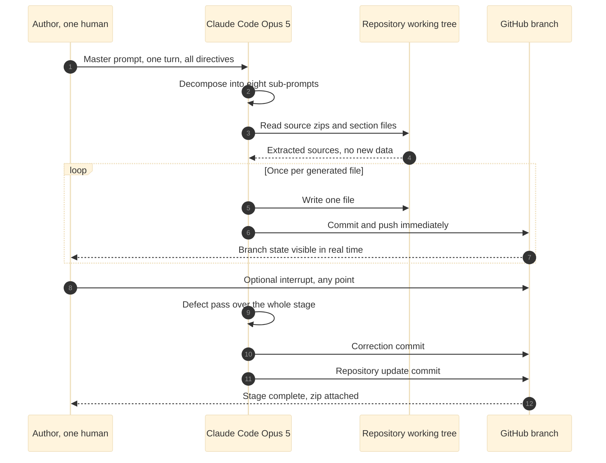

# Figure 4 - One generation turn, end to end

**Type.** mermaid-type, `sequenceDiagram`. **Section.** §2, Methods.
**Perspective.** *What happens between the author pressing return on one master
prompt and the author seeing a file appear on a branch, including the four
participants and the two places the loop returns.* No other figure in this paper
draws the mechanism of a single turn; Figure 3 draws the fork and join of the
whole eight-stage schedule, and Figure 5 draws what the turn stores rather than
what it does.

**Caption (2 balanced lines, 71 and 73 characters, numbered as printed).**

```
Figure 4. One generation turn from master prompt to pushed commit, with the
four participants, the two return paths, and the point the author can stop it.
```

## Mermaid source



## TikZ construction notes

Drawn with the `mm*` sequence primitives: `mmactor` heads, `mmlife` dashed
lifelines, `mmact` activation bars, `mmmsg` solid calls, `mmret` dashed
returns. Absolute coordinates throughout. Canvas 14.4 by 9.4 cm.

| Element | Style token | Placement |
|:--|:--|:--|
| Four actor heads | `mmactor`, `text width=25mm` | y = 0; x = 0.9, 5.2, 9.5, 13.6 |
| Four lifelines | `mmlife` | Vertical from y = -0.55 to y = -8.85 at each actor x |
| Author activation | `mmact`, `minimum height=8.30cm` | x = 0.9, spanning y = -0.55 to -8.85 |
| Claude activation | `mmact`, `minimum height=7.30cm` | x = 5.2, spanning y = -0.95 to -8.25 |
| Self-call arcs, steps 2 and 11 | `mmmsg`, `bend left=62`, loop width 0.85 cm | x = 5.2, at y = -1.55 and y = -7.05 |
| Message rows | `mmmsg` solid, `mmret` dashed | Pitch 0.62 cm from y = -0.95 down to y = -8.55 |
| Loop frame | `mmlane`, `fit` rows 5 to 7 | `inner sep=5pt`, label `loop [once per generated file]` at north west |
| Loop label tab | `mmlanetitle` | Anchored north west inside the frame, 1.2 mm in |
| Interrupt row | `mmedged`, `mmlabel` on the line | y = -6.45, from Author to GitHub, drawn above the loop frame's south edge by 6 mm |
| Row numbers | `\tiny` in `mmlabel` | Left of each row at x = -0.45 |
| In-figure note | `pnote` | x = -0.45, y = -9.35, `text width=138mm` |

Rows are set at a single 0.62 cm pitch so the diagram reads as a clock. The
loop frame is the only rectangle on the canvas and encloses exactly three rows,
which is the claim: the unit of work is one file, not one stage.

## Edge routing

A sequence diagram cannot produce a crossing between message rows, because
every row occupies its own horizontal band. The two constructs that can collide
are the self-call arcs at rows 2 and 11 and the loop frame's west edge. Both
arcs are drawn with `bend left=62` and a fixed 0.85 cm loop width to the right
of the Claude lifeline, away from the frame, and row 11 sits 0.60 cm below the
frame's south edge. The optional-interrupt row is dashed and runs the full
width from the Author lifeline to the GitHub lifeline at y = -6.45, which is
0.60 cm below the loop frame's south edge, so it crosses no activation bar and
no frame rule.

## What each numbered row corresponds to in this build

| Row | Event | Evidence in this repository |
|:--|:--|:--|
| 1 | Master prompt received | `new-trial-system/prompts/prompt-new-trial.md` |
| 2 | Decomposition into eight sub-prompts | `new-trial-system/sub-prompts/README.md` |
| 3 to 4 | Source extraction, nothing invented | The nine source archives listed in `new-trial-system/inputs/README.md` and the four `publication/` directories |
| 5 to 7 | One file, one commit, pushed | Every commit on the working branch |
| 8 | Author interrupt available at any point | Branch is public while the run is in progress |
| 9 to 10 | Stage defect pass and correction commit | Second-to-last commit of each stage |
| 11 to 12 | Repository update and packaged zip | Last commit of each stage |

## Repository sources

- `new-trial-system/prompts/prompt-new-trial.md` - the master prompt this turn begins with
- `new-trial-system/sub-prompts/README.md` - the eight-stage decomposition row 2 produces
- `funding/capitalization-plan/prompts/prompt-capital.md` - the prior single-prompt build this method is adapted from
- `funding/capitalization-plan/sub-prompts/README.md` - the eight-stage precedent, adapted here to a different section set
