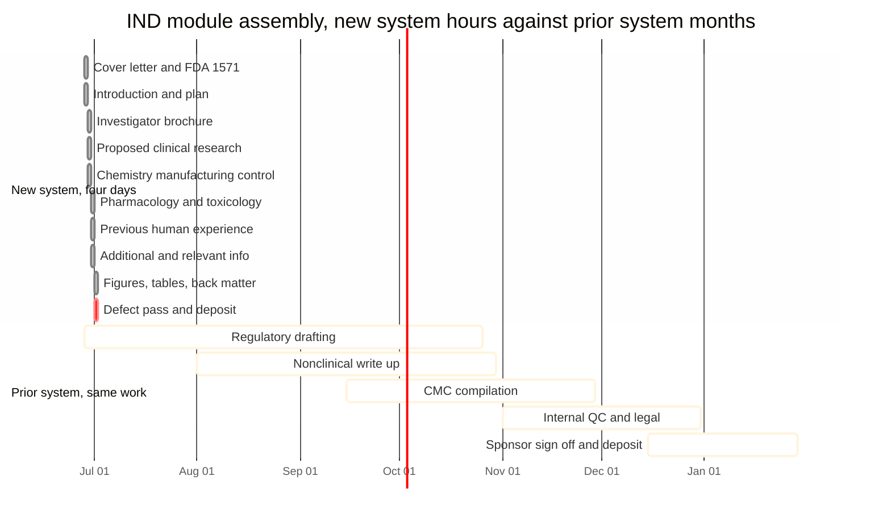

# Figure 7 - The IND assembly clock, hours against months

**Type.** mermaid-type, `gantt`. **Section.** §3, IND.
**Perspective.** *The twelve modules of one Phase 1 IND placed on a single
horizontal clock, with the prior system's calendar for the same twelve modules
drawn beneath as a second band, so the two are read against one axis rather than
against two separate charts.* No other figure in this paper places two time
regimes on one axis; Figure 17 is also a gantt but plots deposit dates for
funding artifacts across a calendar year and carries no comparison band.

**Caption (2 balanced lines, 72 and 74 characters, numbered as printed).**

```
Figure 7. Twelve IND modules on one clock: the new system in hours across four
days, and the prior system's published calendar for the same work, in months.
```

## Mermaid source



## TikZ construction notes

Drawn with the `mm*` gantt primitives: `mmband` alternating row grounds,
`mmbar` pale bars, `mmbark` emphasis bars, `mmbarg` neutral bars. The mermaid
source above is the specification of the claim; the LaTeX figure compresses the
prior-system band to the same axis by using a broken axis, because 390 days and
4 days cannot share a linear scale legibly.

| Element | Style token | Placement |
|:--|:--|:--|
| Axis rule, upper band | `axisx` | y = 0.35, from x = 0 to x = 6.20 |
| Upper axis ticks, hours | `\tiny` labels | x = 0, 1.55, 3.10, 4.65, 6.20 for hour 0, 24, 48, 72, 96 |
| Ten new-system bars | `mmbar`, module 10 `mmbark` | Rows y = 0.0 down to -3.15, pitch 0.35 cm, height 0.24 cm |
| Row labels, left | `\tiny\sffamily`, anchor east | x = -0.15 at each row y |
| Break glyph | Two 0.9 pt charcoal slashes | x = 6.75, spanning y = 0.55 to -4.55 |
| Axis rule, lower band | `axisx` | y = -4.05, from x = 7.30 to x = 13.50 |
| Lower axis ticks, months | `\tiny` labels | x = 7.30, 8.85, 10.40, 11.95, 13.50 for month 0, 3, 6, 9, 12 |
| Five prior-system bars | `mmbarg` | Rows y = -4.40 down to -5.80, pitch 0.35 cm |
| Two band titles | `ptitle` | x = 0, y = 0.95 and x = 7.30, y = 0.95 |
| Ratio callout | `mmgoal`, `text width=34mm` | x = 11.10, y = -1.55, one node, no edge |
| Legend | `legkey` three swatches | x = 0, y = -6.45, 0.30 cm swatches at 3.10 cm pitch |
| In-figure note | `pnote` | x = 0, y = -7.05, `text width=134mm` |

Both bands use the same 0.35 cm row pitch and the same 0.24 cm bar height, so
the two regimes are visually commensurable even though their axes are not. The
break glyph is the only place the figure admits the two scales differ, and it
is drawn once, at full canvas height, so it cannot be missed.

## Edge routing

A gantt carries no edges, so the defect class here is bar-to-label collision
rather than line crossing. Every row label is set anchored east at x = -0.15,
which is 1.5 mm clear of the leftmost bar origin at x = 0, and every label is
capped at 30 characters so no label reaches the frame rule. The single ratio
callout node sits in the upper band's empty right quadrant, between x = 9.85
and x = 13.35 and between y = -0.85 and y = -2.25, a region no bar enters,
because the longest new-system bar ends at x = 6.20. The legend row sits 0.65
cm below the lowest bar and does not overlap the in-figure note.

## The twelve modules and their evidence

| Module | IND section file | Prior-system band |
|:--|:--|:--|
| Cover letter | `sec-00-cover-letter.tex` | Regulatory drafting |
| FDA forms 1571 and 1572 | `sec-01-fda-forms.tex` | Regulatory drafting |
| Introduction | `sec-02-introduction.tex` | Regulatory drafting |
| General investigational plan | `sec-03-general-investigational-plan.tex` | Regulatory drafting |
| Investigator's brochure | `sec-04-investigator-brochure.tex` | Nonclinical write up |
| Proposed clinical research | `sec-05-proposed-clinical-research.tex` | Regulatory drafting |
| Chemistry, manufacturing, control | `sec-06-cmc.tex` | CMC compilation |
| Pharmacology and toxicology | `sec-07-pharmacology-toxicology.tex` | Nonclinical write up |
| Previous human experience | `sec-08-previous-human-experience.tex` | Internal QC and legal |
| Additional information | `sec-09-additional-information.tex` | Internal QC and legal |
| Relevant information | `sec-10-relevant-information.tex` | Internal QC and legal |
| References and back matter | `sec-11-references-backmatter.tex` | Sponsor sign off |

## Repository sources

- `trial-ind/final-ind/publication/LaTeX Source Files.zip` - the twelve section files, their content, and the 22-figure catalog the assembly produced
- `trial-ind/final-ind/README.md` - the four-stage build record and the repository version at deposit
- `new-trial-system/abstracts/README.md` - the July 1, 2026 IND abstract that fixes the deposit date
