# Figure 11 - The dose and autonomy escalation ladder

**Type.** mermaid-type, `flowchart LR`. **Section.** §4, Trial Protocol.
**Perspective.** *The single ladder that runs from the Phase 0 simulation gate
through the Phase 1 3+3 dose escalation to Phase 2 randomization, with the gate
condition on every rung stated as a testable quantity.* No other figure in this
paper draws the clinical progression; Figure 10 draws one participant's state
machine within a single cohort, and Figure 12 draws what the Phase 2 document
inherits from the Phase 1 document rather than what a participant does.

**Caption (2 balanced lines, 76 and 75 characters, numbered as printed).**

```
Figure 11. From the Phase 0 simulation gate through three 3+3 dose levels to
Phase 2 randomization, with the quantity that must hold on each rung shown.
```

## Mermaid source

```mermaid
%%{init: {'theme':'base','themeVariables':{'fontSize':'12px','lineColor':'#6B6B6B'}}}%%
flowchart LR
    subgraph P0["Phase 0, before any patient contact"]
        direction TB
        S1["Simulation validation<br/>at least 1000 procedures<br/>across 2 frameworks"]:::soft
        S2["Unified Safety Level<br/>rating at or above 7.0"]:::soft
    end
    G0{"Gate 0<br/>both hold?"}:::dec
    subgraph P1["Phase 1, first in human, n up to 18"]
        direction TB
        D1["DL1 cohort<br/>3+3, sentinel<br/>staggered enrollment"]:::mid
        D2["DL2 cohort<br/>3+3"]:::mid
        D3["DL3 cohort<br/>3+3, RP2D declared"]:::mid
    end
    G1{"Gate 1<br/>DLT below<br/>cohort limit?"}:::dec
    HOLD["Stop or de escalate<br/>prespecified pause rule"]:::gray
    subgraph P2["Phase 2, multicenter randomized, n equals 220"]
        direction TB
        R1["Randomize 1 to 1<br/>8 high volume centers"]:::soft
        R2["PFS primary<br/>about 140 events"]:::soft
    end
    OUT["Hazard ratio 0.60 target<br/>85 percent power<br/>two sided alpha 0.05"]:::goal
    S1 --> G0
    S2 --> G0
    G0 -->|yes| D1
    G0 -->|no| HOLD
    D1 --> D2
    D2 --> D3
    D3 --> G1
    G1 -->|no| HOLD
    G1 -->|yes| R1
    R1 --> R2
    R2 --> OUT
    classDef goal fill:#800020,stroke:#2E2E2E,stroke-width:1.5px,color:#FFFFFF
    classDef mid fill:#A32A3C,stroke:#800020,stroke-width:1px,color:#FFFFFF
    classDef soft fill:#E2D6D9,stroke:#A32A3C,stroke-width:1px,color:#2E2E2E
    classDef dec fill:#C9C9C9,stroke:#2E2E2E,stroke-width:1px,color:#2E2E2E
    classDef gray fill:#FFFFFF,stroke:#6B6B6B,stroke-width:0.8px,color:#2E2E2E
```



## TikZ construction notes

Absolute coordinates, five columns, drawn left to right because the claim is a
progression and not a hierarchy. Canvas 15.2 by 7.0 cm.

| Element | Style token | Placement |
|:--|:--|:--|
| Phase 0 cluster title | `mmlanetitle` | Anchored south west, 1.3 mm above the frame |
| S1, S2 | `mmsoft`, `text width=28mm` | Column 0, x = 0, y = 1.05 and y = -0.75; pitch 1.80 cm |
| Phase 0 frame | `mmlane`, `fit` S1 and S2 | `inner sep=6pt` |
| Gate 0 | `mmdec`, `aspect=1.9`, `text width=20mm` | Column 1, x = 4.05, y = 0.15 |
| D1, D2, D3 | `mmmid`, `text width=28mm` | Column 2, x = 7.90, y = 1.55, 0.15, -1.25; pitch 1.40 cm |
| Phase 1 frame | `mmlane`, `fit` D1 to D3 | `inner sep=6pt`, clear of Gate 0 by 11 mm |
| Gate 1 | `mmdec`, `aspect=1.9`, `text width=20mm` | Column 3, x = 11.60, y = 0.15 |
| HOLD | `mmgray`, `text width=27mm` | Column 3, x = 11.60, y = -2.85, below Gate 1 |
| R1, R2 | `mmsoft`, `text width=28mm` | Column 4, x = 15.20, y = 1.15 and y = -0.35; pitch 1.50 cm |
| Phase 2 frame | `mmlane`, `fit` R1 and R2 | `inner sep=6pt` |
| OUT | `mmgoal`, `text width=32mm` | Column 4, x = 15.20, y = -2.35 |
| Gate labels yes and no | `mmlabel` | `fill=protowhite`, `inner sep=1.5pt`, so each punches a hole in its line |
| In-figure note | `pnote` | x = 0, y = -3.85, `text width=144mm` |

The Phase 1 rungs are drawn at a 1.40 cm pitch and the Phase 0 and Phase 2
pairs at 1.80 and 1.50 cm, so the escalation band reads denser than the bands
either side of it, which is the claim: the ladder is tight in the middle.

## Edge routing

Nine of the eleven edges run strictly left to right in their own band and
cannot cross a node. The two that could are `G0 --> HOLD` and `G1 --> HOLD`,
because HOLD sits at x = 11.60 below the Phase 1 frame while Gate 0 sits at
x = 4.05. `G1 --> HOLD` is a straight vertical drop and crosses nothing.
`G0 --> HOLD` is routed as a three-segment orthogonal path: down from Gate 0's
south anchor to y = -3.55, right to x = 11.60, then up into HOLD's south
anchor, passing 7 mm below the Phase 1 frame's south edge. The two arrowheads
enter HOLD at different anchors, north and south, so they do not collide. Edge
labels `yes` and `no` are placed at the midpoint of the first segment of each
edge, each with a white fill that punches a hole in the line beneath it.

## The quantities on each rung

| Rung | Quantity that must hold | Source |
|:--|:--|:--|
| Phase 0 | At least 1000 simulated procedures across at least 2 independent frameworks | `trial-protocol/final-protocol` §1 synopsis |
| Phase 0 | Unified Safety Level rating at or above 7.0 | `trial-protocol/final-protocol` §1 synopsis |
| DL1 to DL3 | Standard 3+3, staggered sentinel enrollment, up to n = 18 | `trial-protocol/final-protocol` §4 design |
| Gate 1 | Dose-limiting toxicity rate below the cohort limit, RP2D declared | `trial-protocol/final-protocol` §3 objectives |
| Phase 2 | n = 220 randomized 1:1 at 8 high-volume HPB centers | `trial-phase-2/final-protocol` §1 synopsis |
| Phase 2 | About 140 PFS events, 85 percent power, two-sided alpha 0.05, target hazard ratio 0.60 | `trial-phase-2/final-protocol` §1 synopsis |

## Repository sources

- `trial-protocol/final-protocol/publication/LaTeX Source Files.zip` - the Phase 0 gate, the 3+3 design, the n = 18 cap, and the pause and stopping rules
- `trial-phase-2/final-protocol/publication/author/LaTeX Source Files.zip` - the n = 220 randomization, the eight centers, the 140-event target, and the hazard ratio
- `new-trial-system/abstracts/README.md` - the June 21 and June 23, 2026 abstracts that fix both deposit dates
