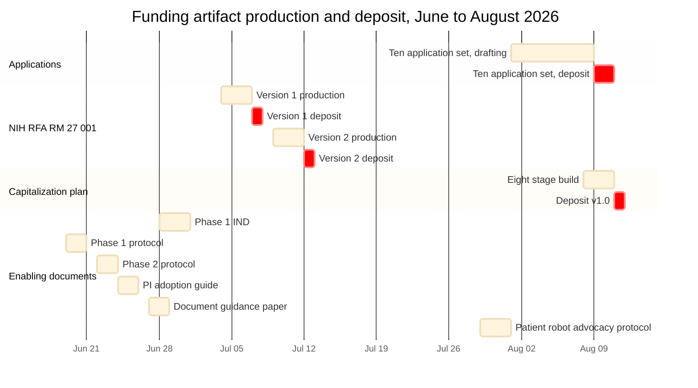

# Figure 17 - The 2026 funding artifact calendar

**Type.** mermaid-type, `gantt`. **Section.** §6, Funding Proposals.
**Perspective.** *Every funding artifact the system produced in 2026 placed on
one calendar, with the deposit date on each, so a funder can see the production
rate rather than a list of titles.* No other figure in this paper plots the
funding record; Figure 18 tabulates the money the artifacts ask for, Figure 19
routes those dollars to work layers, and Figure 20 draws the machinery that
produced the artifacts rather than when they appeared.

**Caption (2 balanced lines, 74 and 72 characters, numbered as printed).**

```
Figure 17. Fourteen funding artifacts deposited between June and August 2026,
their production windows, and the four deposits that closed within one week.
```

## Mermaid source



## TikZ construction notes

Drawn with `mmband`, `mmbar`, `mmbark` and `mmbarg`. One linear axis, because
every artifact in this figure lies inside a single 74-day window and no broken
axis is needed. Canvas 14.8 by 8.0 cm.

| Element | Style token | Placement |
|:--|:--|:--|
| Axis rule | `axisx` | y = 0.30, from x = 0 to x = 12.60 |
| Axis ticks | `\tiny` labels, anchor north | x = 0, 2.52, 5.04, 7.56, 10.08, 12.60 for Jun 15, Jun 30, Jul 15, Jul 30, Aug 14, Aug 29 |
| Four section bands | `mmband` | Alternating rows behind each section, `inner sep=0pt`, full axis width |
| Section labels | `mmlanetitle`, anchor east | x = -0.15 at the vertical center of each band |
| Production bars | `mmbar` | Height 0.22 cm, rows at 0.34 cm pitch from y = -0.10 to y = -4.86 |
| Deposit bars | `mmbark` | Same height, drawn immediately right of their production bar with no gap |
| Four one-week deposits | `mmgoal` outline, 0.9 pt | Ring drawn around the four deposit bars named in the caption |
| Row labels | `\tiny\sffamily`, anchor east | x = -0.15, capped at 31 characters |
| Today marker | Charcoal dashed rule, 0.5 pt | x = 12.10, labeled `Aug 14, 2026` at the top |
| Count callout | `mmmid`, `text width=32mm` | x = 1.60, y = -5.75, one node, no edge |
| Legend | `legkey`, three swatches | x = 6.20, y = -5.75, 0.30 cm swatches at 2.90 cm pitch |
| In-figure note | `pnote` | x = -0.15, y = -6.45, `text width=140mm` |

Production bars and deposit bars share a row and abut, so each artifact reads as
one object whose right end is its deposit. The deposit segment is always the
darker fill, which puts the eye on the date that matters to a funder.

## Edge routing

A gantt carries no edges. The two collision classes here are label-to-bar and
callout-to-bar. Row labels are anchored east at x = -0.15 and capped at 31
characters, so the longest label ends 1.5 mm clear of the axis origin. The
count callout occupies x = 0.35 to x = 3.55 and y = -5.35 to y = -6.15, a
region 0.49 cm below the lowest bar row, so it cannot collide with any bar.
The `Aug 14, 2026` today marker is drawn at x = 12.10, right of every bar
except the ten-application deposit, whose right edge is at x = 11.76, giving
3.4 mm of clearance.

## The fourteen artifacts and their deposits

| Artifact | Deposit date | Repository location |
|:--|:--|:--|
| Phase 1 protocol | Jun 21, 2026 | `trial-protocol/final-protocol/publication` |
| Phase 2 protocol | Jun 23, 2026 | `trial-phase-2/final-protocol/publication/author` |
| Oncology trial PI LLM adoption guide | Jun 25, 2026 | `trial-documents` |
| Phase 1 efficient LLM document guidance | Jun 29, 2026 | `trial-documents` |
| Phase 1 IND | Jul 1, 2026 | `trial-ind/final-ind/publication` |
| RFA-RM-27-001 version 1 | Jul 7, 2026 | `funding/RFA-RM-27-001` |
| RFA-RM-27-001 version 2 | Jul 12, 2026 | `funding/RFA-RM-27-001-v2` |
| Patient robot advocacy protocol | Jul 31, 2026 | `trial-documents` |
| Ten funding applications, set of ten | Aug 2026 | `funding/pdac-funding-applications/final-apply/publication` |
| Capitalization plan | Aug 11, 2026 | `funding/capitalization-plan/final-capital/publication` |

## Repository sources

- `funding/pdac-funding-applications/final-apply/publication/LaTeX Source Files.zip` - the ten applications, their mechanisms, and the August deposit
- `funding/RFA-RM-27-001-v2/LaTeX Source Files.zip` - version 2 of the NIH application and its July 12 citation line
- `funding/capitalization-plan/final-capital/publication/LaTeX Source Files.zip` - the eight-stage build and the August 11 deposit
- `new-trial-system/abstracts/README.md` - every deposit date in the table above
