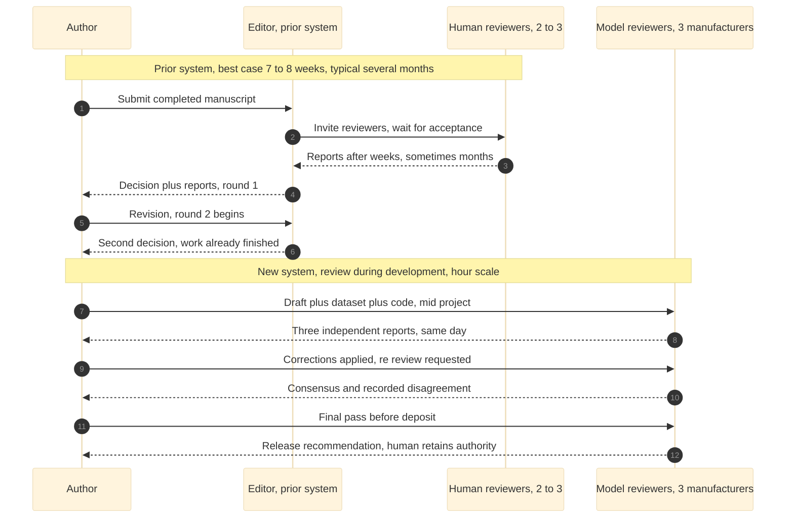

# Figure 21 - Two review clocks, one manuscript

**Type.** mermaid-type, `sequenceDiagram`. **Section.** §7, AI Peer Review.
**Perspective.** *The same manuscript carried through prior-system human peer
review and new-system AI peer review, drawn as two lanes on one clock, so the
difference is read as elapsed time rather than as an opinion.* No other figure in
this paper draws review as a sequence; Figure 22 tabulates the two regimes on
cost, latency, rounds and reviewer count, Figure 23 draws the concurrency inside
one AI review round, and Figure 24 draws what happens when two reviewers
disagree.

**Caption (2 balanced lines, 73 and 75 characters, numbered as printed).**

```
Figure 21. One manuscript on two clocks: the prior system's serial human
rounds over months, and the new system's parallel model rounds within hours.
```

## Mermaid source



## TikZ construction notes

Drawn with `mmactor`, `mmlife`, `mmact`, `mmmsg` and `mmret`. Absolute
coordinates. Canvas 14.6 by 10.2 cm. The two lanes are separated by a single
charcoal hairline so they read as one clock cut in two, not as two figures.

| Element | Style token | Placement |
|:--|:--|:--|
| Four actor heads | `mmactor`, `text width=25mm` | y = 0; x = 0.9, 5.0, 9.2, 13.5 |
| Four lifelines | `mmlife` | y = -0.55 down to y = -9.55 at each actor x |
| Prior-system band ground | `mmband`, 45 percent Mist tint | Rectangle x = -0.5 to 14.3, y = -0.75 to -4.95 |
| Prior-system note bar | `mmlanetitle` on a `mmgray` strip | y = -0.95, spanning x = 0.9 to 9.2 |
| Prior rows 1 to 6 | `mmmsg` solid, `mmret` dashed | Pitch 0.62 cm from y = -1.55 to y = -4.65 |
| Divider | Charcoal hairline, 0.5 pt | Full width at y = -5.10 |
| New-system note bar | `mmlanetitle` on a `mmsoft` strip | y = -5.45, spanning x = 0.9 to 13.5 |
| New rows 7 to 12 | `mmmsg` solid, `mmret` dashed | Pitch 0.62 cm from y = -6.05 to y = -9.15 |
| Human reviewer activation | `mmact`, Mist fill | x = 9.2, y = -2.15 to -3.35, the wait block |
| Model reviewer activation | `mmact`, burgundy fill | x = 13.5, y = -6.05 to -9.15, continuous |
| Elapsed brackets | `decorations.pathreplacing` brace, Charcoal | Left of the canvas at x = -0.75; upper brace labeled `weeks to months`, lower `hours` |
| In-figure note | `pnote` | x = -0.75, y = -10.05, `text width=140mm` |

The prior-system band carries six rows over 3.10 cm and the new-system band
carries six rows over the same 3.10 cm, which is deliberate: the row counts are
equal, so the only thing the two braces can differ on is the unit on the axis.
That is the figure's whole argument, and it is made by geometry rather than by
a label.

## Edge routing

A sequence diagram cannot cross message rows. The three constructs that can
collide are the two note bars, the divider hairline, and the activation blocks.
The prior-system note bar sits at y = -0.95, which is 0.60 cm above row 1; the
new-system note bar sits at y = -5.45, which is 0.35 cm below the divider and
0.60 cm above row 7. Neither bar overlaps a message row. The human reviewer
activation block spans only rows 2 to 3 and is 2.6 mm wide, centered on the HR
lifeline, so no message arrowhead is obscured. The elapsed braces are drawn
outside the leftmost lifeline at x = -0.75, 1.65 cm clear of the Author
lifeline, so they cannot touch a row label.

## The numbers behind each lane

| Lane | Quantity | Source |
|:--|:--|:--|
| Prior system | Best-case review cycle 7 to 8 weeks; typical journal processing several months with 1 to 2 rounds | AI peer review paper, Introduction |
| Prior system | Faster online journals process in about one month | AI peer review paper, Introduction |
| New system | Whole study, dataset through FastAPI, completed in 14 days by one author | AI peer review paper, Conclusions |
| New system | Three independent model reviewers from three manufacturers in one round | AI peer review paper, Methods |
| New system | Review occurs during development, not after completion | AI peer review paper, Abstract |

## Repository sources

- `new-trial-system/inputs/AI_Peer_Review_Acceleration_of_LLM_Generated_Glioblastoma_Clinical_Trial_Patient_Matching_ML__FDA_ICH_ISO__and_FastAPI.zip` - the 7 to 8 week best case, the several-month typical, the 14-day study, and the three-manufacturer round
- `funding/RFA-RM-27-001-v2/LaTeX Source Files.zip` - the tripartisan review schedule the new-system lane generalizes to a funding application
- `new-trial-system/abstracts/README.md` - the November 30, 2025 abstract that fixes the study's date and scale
