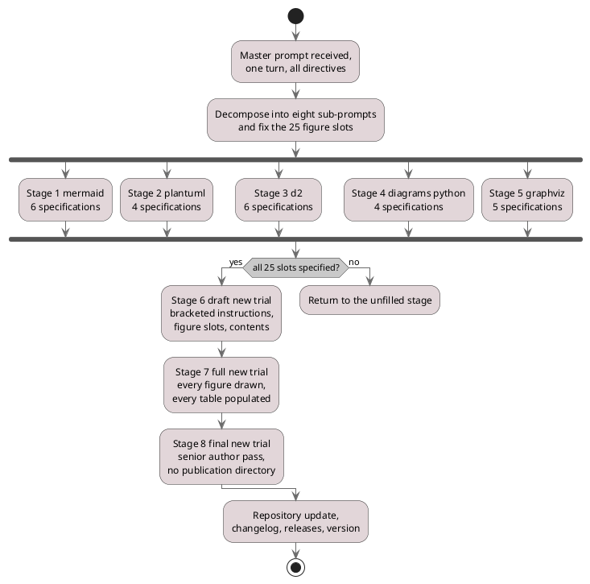

# Figure 3 - One master prompt, five forks, three joins

**Type.** plantuml-type, activity diagram with fork and join. **Section.** §2,
Methods. **Perspective.** *Where concurrency actually exists in the build: five
diagram stages that run against one shared figure specification and must all
close before any LaTeX is written, then three paper stages that are strictly
serial because each reads the one before it.* No other figure in this paper
distinguishes the concurrent part of the method from the serial part; Figure 4
draws one turn inside a stage, and Figure 5 draws what a stage stores.

**Caption (2 balanced lines, 74 and 72 characters, numbered as printed).**

```
Figure 3. The eight-stage build as one activity: five diagram stages fork and
join on a shared specification, then three paper stages run strictly in order.
```

## PlantUML source



## TikZ construction table

Absolute coordinates. Canvas 15.0 by 10.4 cm, drawn top to bottom because the
claim is genuinely a hierarchy of phases, with one horizontal fork band.

| Element | Style token | Placement |
|:--|:--|:--|
| Initial node | `umlinit` | x = 7.50, y = 0 |
| Receive activity | `umlbox`, `text width=44mm` | x = 7.50, y = -0.85 |
| Decompose activity | `umlbox`, `text width=52mm` | x = 7.50, y = -2.05 |
| Fork bar | `umlbar`, width 13.6 cm | x = 7.50, y = -2.95 |
| Five stage activities | `umlctrl`, `text width=25mm` | y = -4.25; x = 0.90, 4.20, 7.50, 10.80, 14.10; pitch 3.30 cm |
| Join bar | `umlbar`, width 13.6 cm | x = 7.50, y = -5.55 |
| Decision diamond | `umldec` via `mmdec`, `aspect=2.2` | x = 7.50, y = -6.50 |
| Stage 6, 7, 8 activities | `umlkey` for 8, `umlbox` for 6 and 7, `text width=40mm` | x = 5.10, y = -7.65, -8.75, -9.85; pitch 1.10 cm |
| Return branch | `umlbox`, `text width=32mm` | x = 12.30, y = -7.65 |
| Detach terminator | `umlfinal` with a diagonal bar | x = 12.30, y = -8.75 |
| Repository update | `umlbox`, `text width=40mm` | x = 5.10, y = -10.95 |
| Final node | `umlfinal` | x = 5.10, y = -11.80 |
| Guard labels yes and no | `umlguard` | On the two edges leaving the diamond, white fill, `inner sep=1.5pt` |
| In-figure note | `pnote` | x = 0, y = -12.55, `text width=142mm` |

The five stage activities sit at a single 3.30 cm horizontal pitch, wider than
any node's 25 mm text width, so 8 mm of clear canvas separates each from its
neighbor. The three paper stages sit at a 1.10 cm vertical pitch, tighter than
the fork band, so the eye reads the serial chain as one object.

## Concurrency table

| Branch | Runs concurrently with | Must close before | Evidence when closed |
|:--|:--|:--|:--|
| Stage 1 mermaid | 2, 3, 4, 5 | Join bar | 6 files in `new-trial-system/mermaid` |
| Stage 2 plantuml | 1, 3, 4, 5 | Join bar | 4 files in `new-trial-system/plantuml` |
| Stage 3 d2 | 1, 2, 4, 5 | Join bar | 6 files in `new-trial-system/d2` |
| Stage 4 diagrams python | 1, 2, 3, 5 | Join bar | 4 files in `new-trial-system/diagrams-python` |
| Stage 5 graphviz | 1, 2, 3, 4 | Join bar | 5 files in `new-trial-system/graphviz` |
| Stage 6 draft | nothing | Stage 7 | `new-trial-system/draft-new-trial` |
| Stage 7 full | nothing | Stage 8 | `new-trial-system/full-new-trial` |
| Stage 8 final | nothing | Repository update | `new-trial-system/final-new-trial` |

The fork is honest: the five diagram stages share only the 25-slot figure plan
fixed before the fork, so none can invalidate another. The three paper stages
are drawn serially because each reads the whole of its predecessor, and drawing
them as a fork would misstate the method.

## Edge routing

Every fork branch is a vertical drop from the fork bar to its activity and a
vertical rise from that activity to the join bar, so no branch changes column
and no two branches can cross. The one edge that changes column is the `no`
branch from the decision diamond to the return activity at x = 12.30; it leaves
the diamond's east anchor, runs right to x = 12.30 along y = -6.50, then drops
into the return activity's north anchor, passing 1.15 cm above the stage 6
activity's north edge. The `yes` branch is a straight drop and crosses nothing.

## Repository sources

- `new-trial-system/prompts/prompt-new-trial.md` - the master prompt and its eight-stage instruction
- `new-trial-system/sub-prompts/README.md` - the stage table this figure renders
- `funding/capitalization-plan/sub-prompts/README.md` - the prior eight-stage schedule, whose fork this build widens from five diagram stages over 20 figures to five over 25
- `funding/capitalization-plan/final-capital/publication/LaTeX Source Files.zip` - the `uml*` vocabulary adapted here
