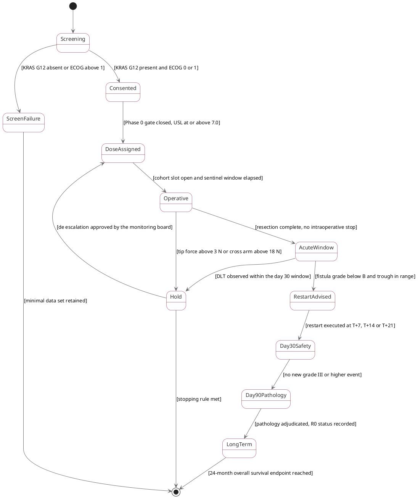

# Figure 10 - One participant's state machine, with guards

**Type.** plantuml-type, state diagram with guards. **Section.** §4, Trial
Protocol. **Perspective.** *The states one enrolled participant can occupy, and
the quantity that must evaluate true before each transition fires, including
the two transitions that route to a hold rather than forward.* No other figure in
this paper takes the participant's point of view; Figure 11 draws the study's
escalation ladder across cohorts, and Figure 13 draws the site infrastructure
around the participant rather than the participant's own state.

**Caption (2 balanced lines, 76 and 76 characters, numbered as printed).**

```
Figure 10. One participant from screening to the 24-month endpoint, with the
guard on every transition and the two conditions that route to a study hold.
```

## PlantUML source



## TikZ construction table

Absolute coordinates. Canvas 15.0 by 9.2 cm. States are drawn in two columns so
the forward chain runs down the left at a constant pitch and every exception
state sits in the right column, which is the figure's organizing rule: the left
column is what happens, the right column is what interrupts it.

| Element | Style token | Placement |
|:--|:--|:--|
| Initial node | `umlinit` | x = 3.20, y = 0.55 |
| Screening | `umlstatesoft`, `text width=30mm` | x = 3.20, y = -0.30 |
| Consented | `umlstate` | x = 3.20, y = -1.60 |
| DoseAssigned | `umlstate` | x = 3.20, y = -2.90 |
| Operative | `umlstateon` | x = 3.20, y = -4.20 |
| AcuteWindow | `umlstate` | x = 3.20, y = -5.50 |
| RestartAdvised | `umlstatesoft` | x = 3.20, y = -6.80 |
| Day30Safety | `umlstate` | x = 3.20, y = -8.10 |
| Day90Pathology | `umlstate` | x = 3.20, y = -9.40 |
| LongTerm | `umlstateon` | x = 3.20, y = -10.70 |
| Final node | `umlfinal` | x = 3.20, y = -11.70 |
| ScreenFailure | `umlstategray` | x = 11.40, y = -0.30 |
| Hold | `umlstategray`, `line width=0.9pt` | x = 11.40, y = -4.85 |
| Hold return waypoint | none, waypoint only | x = 8.10, used by the Hold to DoseAssigned edge |
| Guard labels | `umlguard` | Midpoint of every edge, white fill, `inner sep=1.5pt` |
| Column rule | Charcoal hairline, 0.4 pt, dashed | x = 7.30, full canvas height, labeled `exception column` |
| In-figure note | `pnote` | x = 0, y = -12.45, `text width=142mm` |

The forward chain uses a constant 1.30 cm pitch for nine states, so the left
column reads as a clock. Both exception states sit in the right column at
x = 11.40, 8.20 cm from the forward chain, and the dashed column rule at
x = 7.30 makes the separation explicit rather than implied.

## Guard table

Every transition out of a state carries a guard, and the guards out of any one
state partition the space, so no two can be true at once and no state can
deadlock.

| From | To | Guard | Partition check |
|:--|:--|:--|:--|
| Screening | Consented | KRAS G12 present and ECOG 0 or 1 | Complement of the screen-failure guard |
| Screening | ScreenFailure | KRAS G12 absent or ECOG above 1 | Complement of the consent guard |
| Consented | DoseAssigned | Phase 0 gate closed, USL at or above 7.0 | Single exit, gate blocks until true |
| DoseAssigned | Operative | Cohort slot open and sentinel window elapsed | Single exit |
| Operative | AcuteWindow | Resection complete, no intraoperative stop | Complement of the force guard |
| Operative | Hold | Per-arm tip force above 3 N, or cross-arm above 18 N | Complement of the completion guard |
| AcuteWindow | RestartAdvised | Fistula grade below B and drug trough in range | Complement of the DLT guard |
| AcuteWindow | Hold | Dose-limiting toxicity within the day-30 window | Complement of the restart guard |
| RestartAdvised | Day30Safety | Restart executed at T+7, T+14 or T+21 | Single exit, three permitted values |
| Day30Safety | Day90Pathology | No new grade III or higher complication | Single exit |
| Day90Pathology | LongTerm | Pathology adjudicated, R0 status recorded | Single exit |
| LongTerm | end | 24-month overall survival endpoint reached | Single exit |
| Hold | DoseAssigned | De-escalation approved by the monitoring board | Complement of the stopping guard |
| Hold | end | Prespecified stopping rule met | Complement of the de-escalation guard |

## Edge routing

Eleven forward edges are straight vertical drops in the left column and cannot
cross. Three edges change column. `Screening --> ScreenFailure` is a straight
horizontal run at y = -0.30 and crosses nothing, because no state occupies the
band between x = 3.20 and x = 11.40 at that height. `Operative --> Hold` and
`AcuteWindow --> Hold` both leave their state's east anchor and enter Hold at
its west anchor, one from above and one from below, meeting at two distinct y
values 1.30 cm apart, so the arrowheads do not collide. `Hold --> DoseAssigned`
is the only edge that must travel upward across the canvas: it leaves Hold's
north anchor, rises to y = -2.90, runs left through the waypoint at x = 8.10,
and enters DoseAssigned's east anchor, passing 1.30 cm above the Operative
state's north edge. No guard label sits within 4 mm of another.

## Repository sources

- `trial-protocol/final-protocol/publication/LaTeX Source Files.zip` - the screening window, consent with the Physical AI opt-out, the Phase 0 gate, the tip-force caps, the restart advisory windows, and the pause and stopping rules
- `trial-phase-2/final-protocol/publication/author/LaTeX Source Files.zip` - the monitoring board's de-escalation authority carried into the randomized study
- `trial-ind/final-ind/publication/LaTeX Source Files.zip` - the day-30 safety window and the day-90 pathology assessment as filed
