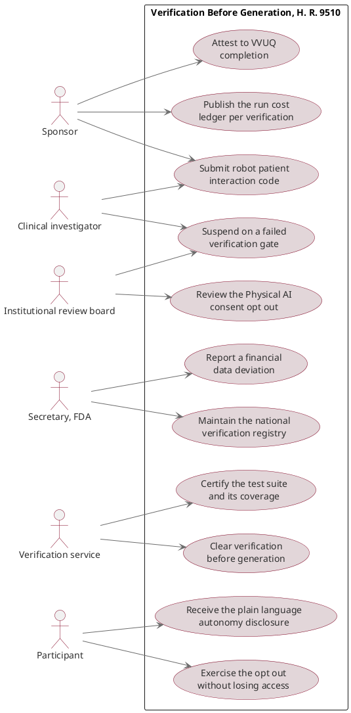

# Figure 14 - The actors a Physical AI trial statute creates duties for

**Type.** plantuml-type, use case diagram. **Section.** §5, Legislation.
**Perspective.** *Which of six actors owns each statutory duty, and the two
duties that cannot be discharged by any actor the prior system recognizes.* No
other figure in this paper assigns duties to named parties; Figure 15 traces how
the bill text itself evolved across five versions, and Figure 16 traces one
requirement downward from statute to a site standard operating procedure.

**Caption (2 balanced lines, 72 and 74 characters, numbered as printed).**

```
Figure 14. Six actors and eleven statutory duties, with the two duties that
no actor recognized by the prior trial system is positioned to discharge.
```

## PlantUML source



## TikZ construction table

Absolute coordinates. Canvas 15.2 by 10.6 cm. Actors stand in two vertical
columns at the canvas edges and the use case rectangle occupies the center, so
no association line has to cross the rectangle boundary twice.

| Element | Style token | Placement |
|:--|:--|:--|
| Sponsor, investigator, IRB | `umlactor` | Left column, x = 0.55, y = -1.10, -4.30, -7.50; pitch 3.20 cm |
| Secretary, verification service, participant | `umlactor` | Right column, x = 14.65, y = -1.10, -4.30, -7.50; same pitch |
| System boundary | `umlpkg`, `fit` all eleven use cases | `inner sep=8pt`, tab at north west |
| Boundary tab | `umlpkgtab` | Anchored north west inside the boundary |
| U1, U2, U3, U4 | `umlusecase`, U2 `umlusekey` | Inner left column, x = 4.95, y = -0.70, -2.30, -3.90, -5.50; pitch 1.60 cm |
| U5, U6, U7, U8 | `umlusecase`, U6 `umlusekey` | Inner right column, x = 10.25, y = -0.70, -2.30, -3.90, -5.50; same pitch |
| U9, U10, U11 | `umlusegray` for U9 and U10, `umlusecase` for U11 | Bottom row, y = -7.30; x = 4.95, 7.60, 10.25; pitch 2.65 cm |
| Association lines | `umlassoc` | Straight, actor anchor to use case anchor, no arrowhead |
| Two unfilled-duty marks | `umlnote` with a leader | Attached to U2 and U8, `text width=30mm`, placed at x = 7.60, y = -3.10 and y = -5.50 |
| In-figure note | `pnote` | x = 0, y = -9.55, `text width=144mm` |

Use cases sit at a 1.60 cm vertical pitch and the actors at 3.20 cm, exactly
double, so every actor sits level with the midpoint between two use cases and
no association line runs horizontally into a neighbor's ellipse.

## Actor and duty table

| Actor | Duties owned | Duty no other actor can discharge |
|:--|:--|:--|
| Sponsor | U1 submit code, U3 publish the cost ledger, U4 attest to VVUQ completion | U3, because only the sponsor holds the per-run cost data the financial amendment makes reportable |
| Clinical investigator | U1 submit code, U6 suspend on a failed gate | Shared suspension authority with the IRB, exercisable at the bedside |
| Institutional review board | U5 review the Physical AI consent opt-out, U6 suspend | U5, because consent review is the board's statutory function |
| Secretary, FDA | U7 maintain the national verification registry, U11 report a financial data deviation | U7, because no private party can hold a national registry |
| Verification service | U2 clear verification before generation, U8 certify the test suite | Both, and neither exists in the prior system |
| Participant | U9 receive the autonomy disclosure, U10 exercise the opt-out | U10, which is a right rather than a duty and cannot be delegated |

The two duties the caption names are U2 and U8. Both belong to the verification
service, which is an actor the prior trial system does not define: there is no
party today whose statutory function is to clear robot-patient interaction code
before that code is generated, and no party whose function is to certify the
coverage of the suite that clears it.

## Edge routing

Thirteen association lines are drawn. Every line runs from an actor anchor
directly to a use case anchor within the same horizontal half of the canvas, so
no line crosses the center vertical at x = 7.60 except the three that reach the
bottom row. Those three, `IRB --> U5`, `SEC --> U7` and `PT --> U9`, enter the
bottom row from below the boundary rectangle, at y = -8.35, and rise into the
south anchor of their use case, so they pass beneath every ellipse rather than
through the field of them. No association line touches an ellipse it is not
attached to, and the two note leaders are drawn at 0.4 pt in Slate Gray so they
read as annotation rather than as association.

## Repository sources

- `new-trial-system/inputs/HR-9510-Bill-v5.zip` - the findings, the amendment text, the financial data sections, and the cost ledger duty
- `new-trial-system/inputs/VVUQ-Physical-AI-Oncology-Trial-Bill.zip` - the statutory text, definitions, attestations and compliance sections that name the verification service
- `new-trial-system/inputs/Earning-the-Clinician's-Trust.zip` - the eight-question trust framework, from which the autonomy disclosure and opt-out duties are drawn
- `trial-protocol/final-protocol/publication/LaTeX Source Files.zip` - the Physical AI consent opt-out as implemented in a protocol
