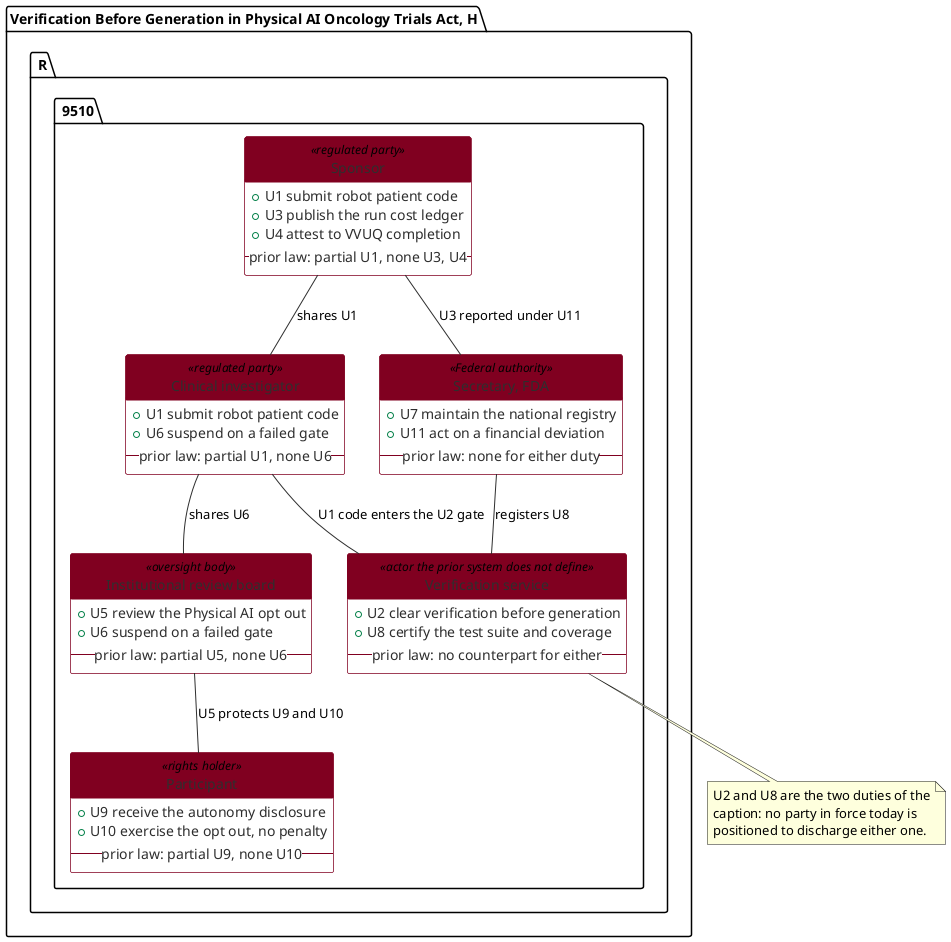

# Figure 14 - The actors a Physical AI trial statute creates duties for

**Type.** plantuml-type, class diagram. **Section.** §5, Legislation.
**Perspective.** *Which of six actors owns each statutory duty, and the two
duties that cannot be discharged by any actor the prior system recognizes.* No
other figure in this paper assigns duties to named parties; Figure 15 traces how
the bill text itself evolved across five versions, and Figure 16 traces one
requirement downward from statute to a site standard operating procedure.

**Caption (2 balanced lines, 75 and 73 characters, numbered as printed).**

```
Figure 14. Six actors and eleven statutory duties, with the two duties that
no actor recognized by the prior trial system is positioned to discharge.
```

## Why this figure is a class diagram and not a use case diagram

The final stage drew this figure as a use case diagram: six stick actors in two
edge columns, eleven ellipses inside a system boundary, and thirteen association
lines reaching across the boundary between them. That drawing is replaced at the
update stage, for two reasons that a reader sees before reading anything.

1. **The lines did not connect.** A stick actor is drawn as five strokes with a
   caption beneath. The TikZ node that carries the actor's name is the caption,
   not the glyph, so every association terminated at the text rather than at the
   figure it was supposed to touch. The reader sees thirteen lines that stop
   short of the thing they point at.
2. **The glyph is elementary.** A five-stroke figure is the notation a reader
   associates with an introductory slide, not with an argument about who owes a
   statutory duty. Beside a bill that amends the Federal Food, Drug, and
   Cosmetic Act, it undercuts the material it is drawing.

A class diagram removes both defects at their source rather than patching them.
Ownership stops being a line at all: the duty is written **inside** the party
that owes it, in the class's member compartment. The only lines that remain are
the six places where two parties actually interact, and each of those runs from
one class frame to another, so every line meets a rectangle edge at both ends.
Thirteen association lines become six, and the figure gains the eleven duty
numbers, six stereotypes and six prior-law verdicts it could not previously
carry without a second table.

## PlantUML source



## TikZ construction table

Absolute coordinates. Canvas 15.8 by 8.3 cm. Six classes on a three by two
grid; every association is either horizontal inside a row or vertical inside a
column, so no two lines can meet except at a class frame.

| Element | Style token | Placement |
|:--|:--|:--|
| Sponsor, Clinical investigator, IRB | `\umlclass` | Row 1, north west corners at x = 0.30, 5.85, 11.40; y = 0 |
| Secretary, Verification service, Participant | `\umlclass` | Row 2, same three x values; y = -3.85 |
| Class width | fixed | 4.40 cm, gutter 1.15 cm, so 3 x 4.40 + 2 x 1.15 = 15.50 cm |
| Name compartment | `umlclshdr`, `umlclshdrg` for the two oversight parties, `umlclshdrk` for the verification service | Anchored north west at the class corner |
| Member compartment | `umlclsbody`, `umlclsbodyg`, `umlclsbodyk` | Anchored north west at the header's south west, offset 0.001 cm so the two frames share one rule |
| System boundary | `umlpkg`, `fit` over all twelve compartment nodes | `inner sep=9pt` |
| Boundary tab | `umlpkgtab` | Anchored south west, 1.2 mm above the boundary's north west |
| Three horizontal associations | `umlassoc`, label `umlassoclbl` on two lines | `sp.east` to `ci.west`, `ci.east` to `ib.west`, `se.east` to `vs.west` |
| Three vertical associations | `umlassoc`, label `umlassoclbl` on one line | `sp.south` to `seh.north`, `ci.south` to `vsh.north`, `ib.south` to `pth.north` |
| Note on the two open duties | `umlnote`, `text width=50mm` | North west at x = 10.20, y = -6.80, dashed 0.4 pt leader to `vs.south east` |
| In-figure note | `pnote` | x = 0.30, y = -7.15, three lines |
| Legend | `legkey` x 3 | y = -8.05 at x = 0.30, 4.60, 9.20 |

The 1.15 cm gutter is set by the widest horizontal association label,
`registers / U8`, which sets at about 0.75 cm on two lines and therefore leaves
0.20 cm of clear canvas against each class frame. The 1.70 cm corridor between
the two rows is set by the widest vertical label, `U1 code enters the U2 gate`,
which is white-filled and sits at the midpoint of its own line.

## Actor and duty table

| Actor | Duties owned | Duty no other actor can discharge |
|:--|:--|:--|
| Sponsor | U1 submit code, U3 publish the cost ledger, U4 attest to VVUQ completion | U3, because only the sponsor holds the per-run cost data the financial amendment makes reportable |
| Clinical investigator | U1 submit code, U6 suspend on a failed gate | Shared suspension authority with the IRB, exercisable at the bedside |
| Institutional review board | U5 review the Physical AI consent opt-out, U6 suspend | U5, because consent review is the board's statutory function |
| Secretary, FDA | U7 maintain the national verification registry, U11 act on a financial data deviation | U7, because no private party can hold a national registry |
| Verification service | U2 clear verification before generation, U8 certify the test suite | Both, and neither exists in the prior system |
| Participant | U9 receive the autonomy disclosure, U10 exercise the opt-out | U10, which is a right rather than a duty and cannot be delegated |

The two duties the caption names are U2 and U8. Both belong to the verification
service, which is an actor the prior trial system does not define: there is no
party today whose statutory function is to clear robot-patient interaction code
before that code is generated, and no party whose function is to certify the
coverage of the suite that clears it. The class carrying them is the only one
drawn in lighter burgundy with a heavier frame, and it is the only class the
figure's note points at.

## Edge routing

Six association lines are drawn, down from thirteen. Three are horizontal and
live entirely inside one row's gutter; three are vertical and live entirely
inside one column's corridor. A horizontal line therefore cannot meet a vertical
one, because the gutters and the corridors do not intersect: a gutter spans
x = 4.70 to 5.85, 10.25 to 11.40 at row height, and a corridor spans
y = -2.15 to -3.85 at column center. Every line terminates on a class frame
anchor rather than on a text node, so both ends of every line are visibly
attached. The note leader is the only dashed stroke in the figure and it is
drawn at 0.4 pt in Slate Gray, running 1.23 cm vertically from the note's north
west corner to the verification service's south east corner, crossing nothing.

## Color assignment

| Fill | Parties | Why |
|:--|:--|:--|
| Burgundy `#800020` header, white body | Sponsor, Clinical investigator, Participant | Parties the prior trial system already regulates or already grants rights to |
| Slate Gray `#6B6B6B` header, Mist Gray `#C9C9C9` body | Institutional review board, Secretary FDA | Oversight and Federal authority, which the prior system also recognizes |
| Lighter burgundy `#A32A3C` header, `#E2D6D9` body, 1 pt frame | Verification service | The one party the prior trial system does not define |

No fill is black or near-black. Charcoal `#2E2E2E` appears only as a stroke and
as association label text.

## Repository sources

- `new-trial-system/inputs/HR-9510-Bill-v5.zip` - the findings, the amendment text, the financial data sections, and the cost ledger duty
- `new-trial-system/inputs/VVUQ-Physical-AI-Oncology-Trial-Bill.zip` - the statutory text, definitions, attestations and compliance sections that name the verification service
- `new-trial-system/inputs/Earning-the-Clinician's-Trust.zip` - the eight-question trust framework, from which the autonomy disclosure and opt-out duties are drawn
- `trial-protocol/final-protocol/publication/LaTeX Source Files.zip` - the Physical AI consent opt-out as implemented in a protocol
