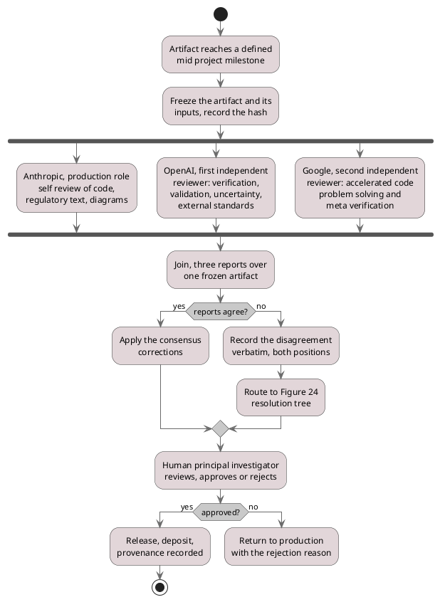

# Figure 23 - Three manufacturers, one join, one human

**Type.** plantuml-type, activity diagram with fork and join. **Section.** §7,
AI Peer Review. **Perspective.** *Where concurrency exists inside one AI peer
review round, and the single point no model can pass: the human approval that
the join feeds.* No other figure in this paper draws the inside of a review
round; Figure 21 draws two review regimes on a clock, Figure 22 tabulates their
economics, and Figure 24 draws only what happens when the three reports
disagree.

**Caption (2 balanced lines, 71 and 73 characters, numbered as printed).**

```
Figure 23. One artifact reviewed concurrently by three model manufacturers,
joined into one recorded disagreement set, and cleared only by the human PI.
```

## PlantUML source



## TikZ construction table

Absolute coordinates. Canvas 15.0 by 12.2 cm. Top to bottom, because the claim
is a pipeline with one gate at its foot.

| Element | Style token | Placement |
|:--|:--|:--|
| Initial node | `umlinit` | x = 7.50, y = 0 |
| Milestone activity | `umlbox`, `text width=46mm` | x = 7.50, y = -0.85 |
| Freeze activity | `umlbox`, `text width=46mm` | x = 7.50, y = -2.05 |
| Fork bar | `umlbar`, width 12.8 cm | x = 7.50, y = -2.95 |
| Anthropic branch | `umlkey`, `text width=34mm` | x = 2.30, y = -4.45 |
| OpenAI branch | `umlctrl`, `text width=34mm` | x = 7.50, y = -4.45 |
| Google branch | `umlctrl`, `text width=34mm` | x = 12.70, y = -4.45; pitch 5.20 cm |
| Join bar | `umlbar`, width 12.8 cm | x = 7.50, y = -6.05 |
| Three reports activity | `umlbox`, `text width=42mm` | x = 7.50, y = -6.85 |
| Agreement diamond | `mmdec`, `aspect=2.2` | x = 7.50, y = -7.95 |
| Consensus activity | `umlbox`, `text width=36mm` | x = 3.60, y = -9.05 |
| Disagreement activities | `umlstategray`, `text width=36mm` | x = 11.40, y = -9.05 and y = -10.05 |
| Human PI activity | `umlkey`, `line width=1pt`, `text width=46mm` | x = 7.50, y = -11.15 |
| Approval diamond | `mmdec`, `aspect=2.2` | x = 7.50, y = -12.25 |
| Release activity, final node | `umlbox`, then `umlfinal` | x = 4.20, y = -13.35 and y = -14.20 |
| Return activity, detach | `umlbox`, then `umlfinal` with a diagonal bar | x = 11.40, y = -13.35 and y = -14.20 |
| Guard labels | `umlguard` | White fill on every diamond exit, `inner sep=1.5pt` |
| Manufacturer badges | `umlnote`, `text width=26mm` | Right of each branch at a 6 mm offset, naming the role only |
| In-figure note | `pnote` | x = 0, y = -14.95, `text width=142mm` |

The three branches sit at a 5.20 cm pitch, well beyond their 34 mm text width,
so 18 mm of clear canvas separates each branch from its neighbor and the fork
and join bars are legible as single horizontal strokes rather than as a hatched
band.

## Concurrency table

| Branch | Manufacturer | Role in this build | Joins at |
|:--|:--|:--|:--|
| 1 | Anthropic | Primary production: code, regulatory adaptations, protocols, IND materials, diagrams, repository-scale artifacts | Join bar |
| 2 | OpenAI | First independent reviewer: verification, validation, uncertainty quantification, external standards, trial-literature synthesis, deep research, PDF review | Join bar |
| 3 | Google | Second independent reviewer: accelerated code problem solving, meta-verification of prior stages, administrative workflow support | Join bar |

All three branches read the same frozen artifact and its recorded hash, so the
fork is honest: no branch can observe another's output, and a disagreement is
therefore evidence rather than an artifact of ordering. The join produces three
reports over one object, which is the unit the resolution tree in Figure 24
consumes.

## Edge routing

Each fork branch is a vertical drop from the fork bar and a vertical rise to
the join bar, so branches cannot cross. Two edges change column, both leaving a
diamond. The `no` branch of the agreement diamond leaves its east anchor, runs
right to x = 11.40 at y = -7.95, then drops into the disagreement activity's
north anchor, passing 1.10 cm above it. The `no` branch of the approval diamond
does the same at y = -12.25 into the return activity. The two `yes` branches
leave their diamonds' west anchors and drop into the left-column activities.
The consensus activity at x = 3.60 and the second disagreement activity at
x = 11.40 both feed the human PI activity at x = 7.50; those two edges enter
the PI activity at its north west and north east anchors respectively, 2.4 cm
apart, so the arrowheads do not collide.

## Repository sources

- `new-trial-system/inputs/AI_Peer_Review_Acceleration_of_LLM_Generated_Glioblastoma_Clinical_Trial_Patient_Matching_ML__FDA_ICH_ISO__and_FastAPI.zip` - the triple review by three manufacturers, the consensus recommendation to change model class, and the review-during-development principle
- `funding/RFA-RM-27-001-v2/LaTeX Source Files.zip` - `sections/ai-peer-review-context.tex`, which assigns Anthropic the production role and OpenAI and Google the two independent reviewer roles, and states that the human PI retains final authority
- `funding/capitalization-plan/final-capital/publication/LaTeX Source Files.zip` - the `uml*` fork and join vocabulary adapted here
