# trial-documents - Phase 1 Pancreatic Cancer Trial Efficient LLM Document Generations (paper v1.0)

[](https://creativecommons.org/licenses/by/4.0/)
[](final-paper)
[](../README.md)
[](.)
[](mermaid)
[](.)
[](prompts/prompt-paper.md)
[](https://doi.org/10.5281/zenodo.21018646)

[Publication with Author Edits](https://github.com/kevinkawchak/physical-ai-oncology-trials/tree/main/trial-documents/final-paper/publication) (final-paper/publication). This directory holds the autonomous, single-prompt build of a new paper, *Phase 1
Pancreatic Cancer Trial Efficient LLM Document Generations* (paper v1.0, within
repository v4.2.0). The paper shows how a repository based large language model
(LLM), driven by one master prompt that first writes and then executes a schedule of
sub-prompts, can hasten the entire Phase 1 process by generating every relevant large
trial document through a mermaid to draft to full to final pipeline, with many
real-time visualizations and a probable-benefit-over-probable-risk argument for
enrolled PDAC patients.

The build is driven by the single master prompt in
[`prompts/prompt-paper.md`](prompts/prompt-paper.md): **Process A** generated every
sub-prompt in [`sub-prompts/`](sub-prompts), and **Process B** runs those sub-prompts
in order, growing the paper from Mermaid figures to a draft, a full, and a final
LaTeX paper. Every distinguishable file is a separate commit pushed in real time
(Rules 6, 7, 8). The paper builds on the *Oncology Trial PI LLM Adoption Guide*
([`inputs/llm-adoption`](inputs/llm-adoption)) as both the template and the practical
guide, and is grounded in four AI research sources in [`research/`](research).

- **Author:** Kevin Kawchak, CEO ChemicalQDevice
  ([ORCID 0009-0007-5457-8667](https://orcid.org/0009-0007-5457-8667))
- **DOI:** [`10.5281/zenodo.xxxxxxxx`](https://doi.org/10.5281/zenodo.xxxxxxxx)
  (placeholder filled at deposit) - **Date:** June 29, 2026 - **Paper:** v1.0 -
  **Repository:** v4.2.0

## Build pipeline (five-color palette)

```mermaid
%%{init: {'theme':'base','themeVariables':{'fontSize':'13px','lineColor':'#6C757D'}}}%%
flowchart LR
    MP["Master prompt<br/>prompts/prompt-paper.md"]:::goal
    SP["Process A<br/>sub-prompts 1-4"]:::proc
    S1["Stage 1 mermaid<br/>24 colored figures"]:::input
    S2["Stage 2 draft-paper<br/>scaffold + instructions"]:::input
    S3["Stage 3 full-paper<br/>prose + TikZ + tables"]:::accent
    S4["Stage 4 final-paper<br/>polished + zip"]:::goal
    REL["Repository update<br/>README + releases + CHANGELOG v4.2.0"]:::proc
    MP --> SP --> S1 --> S2 --> S3 --> S4 --> REL
    classDef goal   fill:#8B2E3F,stroke:#000000,stroke-width:1.5px,color:#FFFFFF
    classDef proc   fill:#2F5D7C,stroke:#000000,stroke-width:1.4px,color:#FFFFFF
    classDef accent fill:#D08770,stroke:#000000,stroke-width:1.3px,color:#111111
    classDef input  fill:#BFD7EA,stroke:#2F5D7C,stroke-width:1.2px,color:#111111
```



## Milestone schedule (one pull request, updated as each lands)

| Milestone | Stage | Output directory | Commits | Status |
|:--|:--|:--|:--|:--|
| M1 | Bootstrap (Process A) | `prompts/`, `sub-prompts/`, directory READMEs | per file | complete |
| M2 | Stage 1 mermaid | [`mermaid/`](mermaid) | 26 (24 figures) | complete |
| M3 | Stage 2 draft-paper | [`draft-paper/`](draft-paper) | 15+ | complete |
| M4 | Stage 3 full-paper | [`full-paper/`](full-paper) | 17+ (24 TikZ, 6 tables) | complete |
| M5 | Stage 4 final-paper | [`final-paper/`](final-paper) | 15+ | complete |
| M6 | Release (v4.2.0) | root `README.md`, `releases.md`, `CHANGELOG.md`, `prompts/output-paper.md` | 4+ | complete |

## Directory map

```
trial-documents/
  README.md                 (this build hub)
  prompts/                  prompt-paper.md (master, verbatim) + output-paper.md
  sub-prompts/              prompt-1-mermaid .. prompt-4-final-paper (Process A)
  mermaid/        (Stage 1) 24 colored Mermaid figure files + README + output
  draft-paper/    (Stage 2) main.tex, paperstyle.sty, references.bib, sections/, zip
  full-paper/     (Stage 3) same set, fully rendered (24 TikZ figures, 6 tables)
  final-paper/    (Stage 4) same set, polished (no publication subdirectory)
  inputs/                   llm-adoption template + references.bib
  research/                 document-types (2) + industry-workflow (2) AI sources
```

## Paper sections (each a sections/*.tex, Rule 6)

Abstract; Keywords; Introduction; Table of Contents (generated in main.tex after the
Introduction); Methods; Results; Discussion; Limitations and Future Work;
Conclusions; References; Back Matter (Acknowledgments, Author and ORCID, Ethical
Disclosures, Data Availability, Rights and Permissions (CC BY 4.0), Cite This
Article).

## Color scheme (Rule for figures)

| Role | Color | Hex |
|:--|:--|:--|
| End goals, patient outcomes, critical decisions | Deep maroon | `#8B2E3F` |
| LLM, system, and process nodes | Steel blue | `#2F5D7C` |
| Acceleration and time-savings emphasis | Terracotta | `#D08770` |
| Inputs and source files | Light blue | `#BFD7EA` |
| Context and supporting nodes | Near-white | `#F4F7F9` |
| Gates and decision diamonds | Gray | `#D9D9D9` |

Body text stays black (the paper template color is kept); only figures carry color.

## Sources used (Rule 5)

| Source | Supplies |
|:--|:--|
| [`inputs/llm-adoption`](inputs/llm-adoption) | The paper template and the practical adoption guide built upon |
| [`inputs/references.bib`](inputs/references.bib) | The author works (Aug 2024 - Jun 2026) and citation keys |
| [`research/document-types`](research/document-types) | Long-document decision-gate taxonomy and the six acceleration targets (2 AI sources) |
| [`research/industry-workflow`](research/industry-workflow) | Before/during/after Phase 1 data and document workflow (2 AI sources) |
| [`../trial-protocol`](../trial-protocol) | The mermaid/draft/full/final workflow pattern and the daraxonrasib Phase 1 protocol |
| [`../trial-protocol/final-protocol/publication`](../trial-protocol/final-protocol/publication) | Image, white-space, and column-width formatting code strategies |
| [`../trial-phase-2`](../trial-phase-2) | The analogous Phase 2 single-prompt multi-file build |

## License

Released under CC BY 4.0. Author: Kevin Kawchak, CEO ChemicalQDevice.

*Independent research paper and practical adoption guide. Not medical or regulatory
advice; not endorsed by the FDA, NIH, HHS, IRB, ICH, or any sponsor. The DOI
placeholder `10.5281/zenodo.xxxxxxxx` is filled at deposit.*
