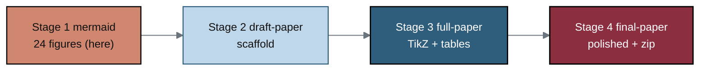

# trial-documents/mermaid - Stage 1 figure catalog (24 colored Mermaid figures)

[](.)
[](.)
[](.)
[](../draft-paper)
[](../../README.md)
[](https://creativecommons.org/licenses/by/4.0/)

Stage 1 of the mermaid -> draft -> full -> final build for the paper *Phase 1
Pancreatic Cancer Trial Efficient LLM Document Generations* (paper v1.0, repository
v4.2.0). Each figure is one Markdown file with a real ```mermaid``` fenced block
that renders natively on GitHub, a caption, the figure's role in the paper, and the
exact repository source files (Rule 5). Every figure is new to this paper and uses
the identical five-step palette so it reproduces 1:1 as a TikZ `mermaidfig` in the
draft, full, and final LaTeX stages. There is no overlap between components in any
figure.

## Color scheme

| Class | Hex | Role |
|:--|:--|:--|
| `goal` | `#8B2E3F` deep maroon | End goals, patient outcomes, critical decisions |
| `proc` | `#2F5D7C` steel blue | LLM, system, and process nodes |
| `accent` | `#D08770` terracotta | Acceleration and time-savings emphasis |
| `input` | `#BFD7EA` light blue | Inputs and source files |
| `ctx` | `#F4F7F9` near-white | Context and supporting nodes |
| `warn` | `#D9D9D9` gray | Gates and decision diamonds |

## Build pipeline



## Figure inventory

| Figure | Title | Paper use | Primary source(s) |
|:--|:--|:--|:--|
| [01](fig-01-single-prompt-pipeline.md) | Single-prompt build pipeline | Methods, Results | prompts/, sub-prompts/ |
| [02](fig-02-subprompt-schedule.md) | Process A / Process B schedule | Methods | prompts/prompt-paper.md, sub-prompts/ |
| [03](fig-03-phase1-document-landscape.md) | Phase 1 document landscape | Methods | research/document-types, industry-workflow |
| [04](fig-04-acceleration-targets.md) | Six acceleration targets | Results, Discussion | document-types (ACCELERATION) |
| [05](fig-05-document-gate-taxonomy.md) | Hard/protocol/decision gates | Methods | document-types (ChatGPT) |
| [06](fig-06-data-collection-pipeline.md) | Before/during/after data pipeline | Methods | industry-workflow (Gemini) |
| [07](fig-07-pretrial-authoring.md) | Pre-trial authoring | Methods | industry-workflow |
| [08](fig-08-intratrial-authoring.md) | During-trial authoring | Methods | industry-workflow |
| [09](fig-09-posttrial-authoring.md) | After-trial authoring | Methods | industry-workflow, document-types |
| [10](fig-10-iteration-timeline.md) | 1-4 day iteration cadence | Introduction, Results | prompts/prompt-paper.md (OUTLINE) |
| [11](fig-11-time-bucket-compression.md) | Three timeline buckets | Introduction, Discussion | document-types (Gemini) |
| [12](fig-12-repo-llm-architecture.md) | Repository LLM architecture | Methods | inputs/llm-adoption/main.tex |
| [13](fig-13-autocommit-monitorability.md) | Auto-commit monitorability | Methods | prompts/prompt-paper.md |
| [14](fig-14-grounding-mermaid-to-tikz.md) | Mermaid-to-TikZ grounding | Introduction, Results | mermaid/, paperstyle.sty |
| [15](fig-15-name-matching-verification.md) | Five name-matching checks | Introduction, Results | prompts/prompt-paper.md (OUTLINE 2) |
| [16](fig-16-benefit-risk-framework.md) | Benefit greater than risk | Introduction, Discussion | prompts/prompt-paper.md (OUTLINE 3) |
| [17](fig-17-patient-time-saved-cascade.md) | Patient time-saved cascade | Introduction, Conclusions | prompts/prompt-paper.md (OUTLINE 1, 3) |
| [18](fig-18-paper-section-architecture.md) | Section-to-.tex architecture | Methods | prompts/prompt-paper.md (PAPER FORMAT) |
| [19](fig-19-five-color-palette.md) | Five-color palette / fidelity | Methods | prompts/prompt-paper.md, paperstyle.sty |
| [20](fig-20-quality-verification-gates.md) | Quality gates, no rework | Results, Discussion | document-types, formatting rules |
| [21](fig-21-daraxonrasib-document-thread.md) | Daraxonrasib document thread | Introduction, Discussion | trial-protocol, trial-phase-2 |
| [22](fig-22-author-trust-timeline.md) | Author LLM-trust timeline | Results, Discussion | inputs/references.bib |
| [23](fig-23-ind-irb-initial-package.md) | IND + IRB package (target 1) | Methods, Results | document-types, industry-workflow |
| [24](fig-24-clinical-hold-response.md) | Clinical-hold response (target 4) | Methods, Results | document-types (ChatGPT) |

## How these figures are used downstream

Every figure here is reproduced as a TikZ `mermaidfig` in
[`../full-paper`](../full-paper) and [`../final-paper`](../final-paper) using the
`mm*` node styles in `paperstyle.sty`, which map 1:1 from the Mermaid `classDef`
classes (`goal`, `proc`, `accent`, `input`, `ctx`, `warn`). The
[`../draft-paper`](../draft-paper) scaffold names each figure file in its
`\draftinstr` pointers.

## License

Released under CC BY 4.0. Author: Kevin Kawchak, CEO ChemicalQDevice.
