## Figure 1. Single-prompt mermaid-draft-full-final build pipeline

```mermaid
%%{init: {'theme':'base','themeVariables':{'fontSize':'12px','lineColor':'#6C757D'}}}%%
flowchart LR
    MP["Master prompt<br/>prompts/prompt-paper.md<br/>paper v1.0, repo v4.2.0"]:::goal
    A["Process A<br/>generate sub-prompts 1-4<br/>one schedule, one palette"]:::proc
    S1["Stage 1 Mermaid<br/>24 colored figures<br/>real quantitative data"]:::input
    S2["Stage 2 draft-paper<br/>scaffold + bracketed instr<br/>8 sections, ToC, 10+ commits"]:::input
    S3["Stage 3 full-paper<br/>full prose + TikZ + tables<br/>24 mermaidfig, 10+ commits"]:::accent
    S4["Stage 4 final-paper<br/>polished + Overleaf zip<br/>clearpage, 10+ commits"]:::goal
    REL["Repository update<br/>README + releases.md<br/>CHANGELOG.md at v4.2.0"]:::proc
    GH["GitHub<br/>real-time auto-commit / auto-PR<br/>monitor branch, no intervention"]:::ctx

    MP -->|"single prompt"| A
    A -->|"prompt-1-mermaid"| S1
    S1 -->|"figures ground prose"| S2
    S2 -->|"resolve [DRAFTING INSTRUCTION]"| S3
    S3 -->|"max quality pass"| S4
    S4 -->|"last commit"| REL

    S1 -.->|"push each figure"| GH
    S2 -.->|"push each .tex"| GH
    S3 -.->|"push each .tex"| GH
    S4 -.->|"final-paper-LaTeX.zip"| GH
    REL -.->|"output-paper.md"| GH
    GH -.->|"human review feedback"| S4

    classDef goal   fill:#8B2E3F,stroke:#000000,stroke-width:1.5px,color:#FFFFFF
    classDef proc   fill:#2F5D7C,stroke:#000000,stroke-width:1.4px,color:#FFFFFF
    classDef accent fill:#D08770,stroke:#000000,stroke-width:1.3px,color:#111111
    classDef input  fill:#BFD7EA,stroke:#2F5D7C,stroke-width:1.2px,color:#111111
    classDef ctx    fill:#F4F7F9,stroke:#6C757D,stroke-width:1.1px,color:#111111
    classDef warn   fill:#D9D9D9,stroke:#000000,stroke-width:1.2px,color:#111111
```

**Caption.** A single master prompt (`prompts/prompt-paper.md`) drives the entire paper build: Process A generates the four stage sub-prompts, which Process B then executes in order to grow the work from 24 colored Mermaid figures, to a bracketed-instruction draft scaffold, to a full paper with TikZ figures and full-width tables, to a polished final paper bundled as `final-paper-LaTeX.zip`. A last commit performs the repository update (root README, `releases.md`, and `CHANGELOG.md` at v4.2.0). The dashed looping edges show that every stage auto-commits and opens auto-PRs to GitHub in real time so the author can monitor branch progress and feed review back into the final stage without manual intervention.

**Role in the paper.** Appears in Methods as the overview of the single-prompt mermaid-draft-full-final pipeline and is referenced again in Results as evidence of real-time monitorability; it becomes a TikZ mermaidfig in the draft, full, and final LaTeX stages.

**Source files.** `trial-documents/prompts/prompt-paper.md` (the single master prompt and sub-prompt schedule); `trial-documents/sub-prompts/prompt-1-mermaid.md`, `prompt-2-draft-paper.md`, `prompt-3-full-paper.md`, `prompt-4-final-paper.md` (the four generated stage sub-prompts and their commit schedules); `trial-documents/sub-prompts/README.md` (Process A / Process B description); `trial-protocol/sub-prompts` (the four-stage mermaid -> draft -> full -> final workflow pattern that was adapted).
