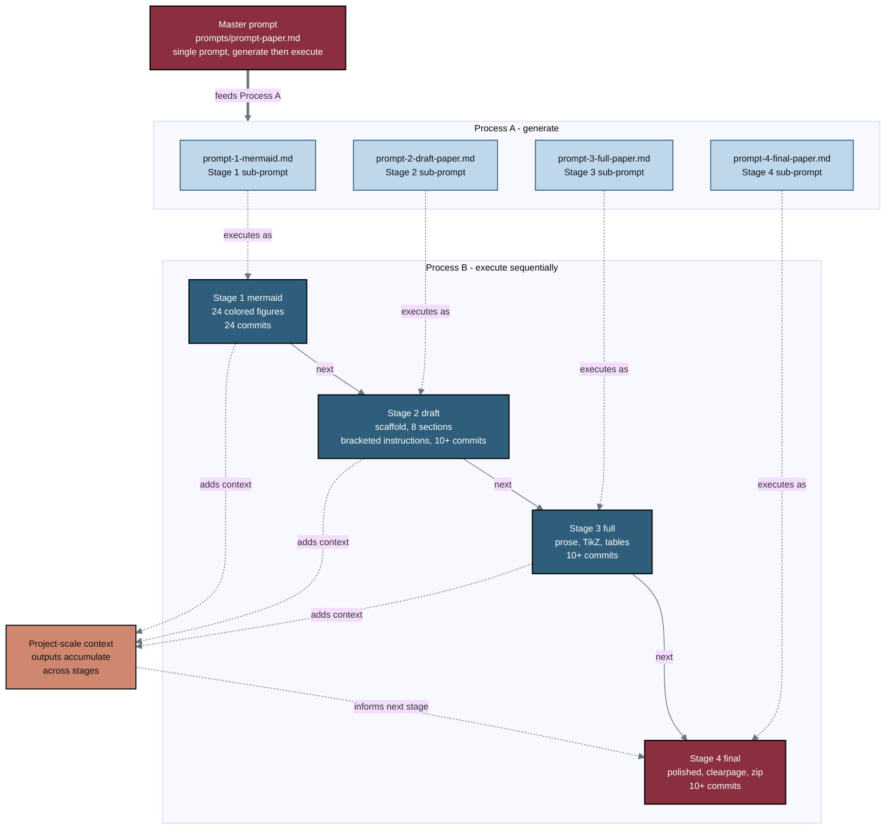

## Figure 2. Process A generation and Process B execution under one master prompt

**Caption.** A single master prompt (prompts/prompt-paper.md) first drives Process A, which generates the four stage sub-prompt files, and then drives Process B, which executes those sub-prompts sequentially. Each sub-prompt maps to one build stage: Stage 1 mermaid (24 colored figures, 24 commits), Stage 2 draft (a scaffold with bracketed drafting instructions, 10+ commits), Stage 3 full (full prose, TikZ figures, and tables, 10+ commits), and Stage 4 final (the polished paper and Overleaf zip, 10+ commits). The dashed loop shows project-scale outputs accumulating as context that informs each subsequent stage, so the final paper is produced under one prompt rather than four independent runs.

**Role in the paper.** Appears in Methods to define the sub-prompt schedule that produces the paper, and it becomes a TikZ mermaidfig in the draft, full, and final LaTeX stages.

**Source files.**
- prompts/prompt-paper.md (the master prompt and SUB-PROMPT SCHEDULE)
- sub-prompts/ (prompt-1-mermaid.md, prompt-2-draft-paper.md, prompt-3-full-paper.md, prompt-4-final-paper.md, README.md)
- inputs/llm-adoption/main.tex (Prompt Proficiency section)
