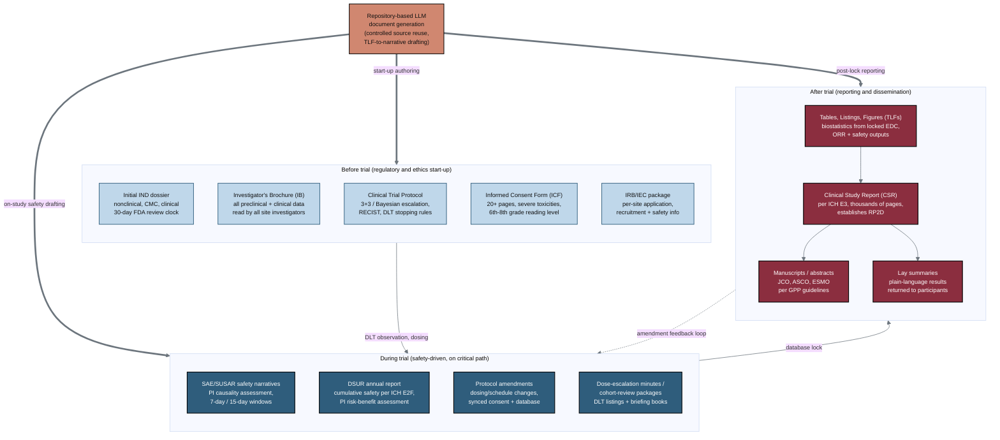

## Figure 3. The large Phase 1 oncology document landscape

**Caption.** This map groups the large Phase 1 oncology documents into three temporal lanes: start-up documents created before the trial (initial IND dossier, Investigator's Brochure, Clinical Trial Protocol, a 20+ page Informed Consent Form at a 6th-8th grade reading level, and the IRB/IEC package), safety-driven documents produced during the trial (SAE/SUSAR narratives on 7-day and 15-day windows, the annual DSUR per ICH E2F, protocol amendments, and dose-escalation minutes and cohort-review packages), and reporting documents generated after database lock (TLFs, the CSR per ICH E3 that establishes the recommended Phase 2 dose, manuscripts and abstracts, and participant lay summaries). A central terracotta hub shows repository-based LLM document generation feeding all three lanes through controlled source reuse and table-to-narrative drafting. Lanes flow forward through DLT observation and database lock, with a curved feedback loop where post-trial findings can trigger in-trial amendments.

**Role in the paper.** It appears in the Methods/Background as the document-landscape overview that motivates which artifacts the repository-based LLM workflow targets, and it becomes a TikZ mermaidfig in the draft, full, and final LaTeX stages.

**Source files.** research/document-types/* (ChatGPT-5-5-Thinking-Extended-DocTypes-2026-06-26.md, Gemini-3-1-Pro-DocTypes-2026-06-26.md, prompt-types.md); research/industry-workflow/* (ChatGPT-5-5-Thinking-Extended-Workflow-2026-06-26.md, Gemini-3-1-Pro-Workflow-2026-06-26.md, prompt-workflow.md).
