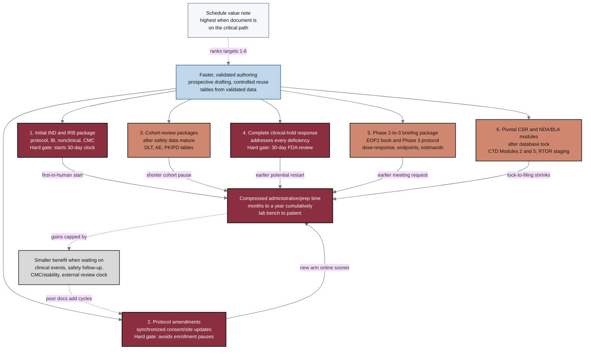

## Figure 4. The six greatest-acceleration document targets

**Caption.** This ranked ladder lists the six document targets where faster, validated authoring yields the greatest schedule value, in priority order from the initial IND and IRB package through the pivotal CSR and NDA/BLA modules after database lock. A single input node, faster validated authoring, feeds all six targets, and each target contributes to a common goal of compressed administrative and prep time, which can cumulatively save months to a year between the laboratory bench and the patient. A looping note marks that value is highest when the document sits on the critical path, while a gray limit node captures the constraints (clinical events, safety follow-up, CMC and stability data, external review clocks) that cap the gains and can add cycles when documents are inconsistent.

**Role in the paper.** It appears in the Results/Discussion as the prioritization of acceleration targets and becomes a TikZ mermaidfig in the draft, full, and final LaTeX stages.

**Source files.**
- trial-documents/research/document-types/ChatGPT-5-5-Thinking-Extended-DocTypes-2026-06-26.md (ACCELERATION list: "Where faster document production has the greatest schedule value")
- trial-documents/research/document-types/Gemini-3-1-Pro-DocTypes-2026-06-26.md (Administrative/Prep Time compression framing)
