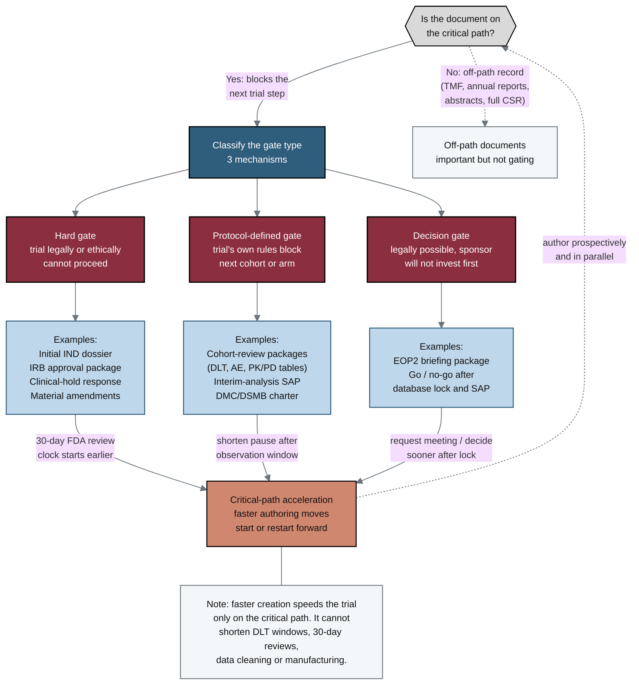

## Figure 5. Document decision-gate taxonomy

**Caption.** This taxonomy classifies trial documents by how they constrain timelines, beginning from the central question of whether a document lies on the critical path. Three gate mechanisms are distinguished: hard gates where the trial legally or ethically cannot proceed (initial IND, IRB approval, clinical-hold response, material amendments), protocol-defined gates where the trial's own rules block the next cohort or arm (cohort-review packages, interim-analysis SAP and DMC/DSMB charter), and decision gates where progress is legally possible but the sponsor will not invest without a decision (EOP2 briefing, go/no-go after database lock). Each gate maps to example documents and to a critical-path acceleration loop, with 30-day FDA review clocks (IND and clinical-hold response) noted as the regulatory durations that earlier authoring can start but not shorten. The context note records that faster creation speeds the trial only on the critical path and cannot shorten DLT windows, statutory reviews, data cleaning or manufacturing.

**Role in the paper.** It appears in the Methods/Results discussion of where accelerated LLM document generation has schedule value, framing the gate taxonomy that organizes the document-type analysis; it becomes a TikZ mermaidfig in the draft, full and final LaTeX stages.

**Source files.** trial-documents/research/document-types/ChatGPT-5-5-Thinking-Extended-DocTypes-2026-06-26.md (hard, protocol-defined and decision gates; example documents; 30-day IND and clinical-hold review clocks; off-path records).
