## Figure 6. Before/during/after Phase 1 data-collection pipeline

```mermaid
%%{init: {'theme':'base','themeVariables':{'fontSize':'12px','lineColor':'#6C757D'}}}%%
flowchart LR
    EHR[EHR source records<br/>physician and nursing notes<br/>pathology and radiology]:::input
    RECIST[Baseline tumor measurement<br/>RECIST 1.1 target lesions<br/>measurable disease]:::input

    subgraph BEFORE[Before: screening and baseline]
        direction TB
        CRC[CRC EHR extraction<br/>eligibility and medical history]:::proc
        EDC[EDC system<br/>Medidata Rave, Oracle Clinical<br/>coded subject identifiers]:::proc
    end

    subgraph DURING[During: treatment and 3+3 escalation]
        direction TB
        ECRF[eCRF entries<br/>dose, cycle, PK and PD times<br/>vital signs]:::proc
        ECOA[eCOA / ePRO tablets<br/>patient-reported symptoms<br/>nausea, fatigue real-time]:::proc
        AE[AE logs graded by CTCAE<br/>onset, grade, causality]:::proc
        DLT{DLT capture<br/>3+3 observation window<br/>escalate or stop}:::warn
    end

    subgraph AFTER[After: follow-up and lock]
        direction TB
        FU[Survival follow-up<br/>progression, date last alive<br/>long-term toxicity]:::proc
        SDV[SDV by CRAs<br/>source document verification<br/>query resolution]:::proc
        LOCK[Database LOCK<br/>data manager sign-off<br/>access restricted, immutable]:::goal
    end

    LOCKED[Locked clean database<br/>SDTM to ADaM to TFLs<br/>traceable, audit-ready]:::accent
    DOCS[Downstream document<br/>generation, e.g. CSR<br/>narratives, disclosures]:::ctx

    EHR -->|extract| CRC
    CRC -->|enter| EDC
    RECIST -->|baseline scan| EDC

    EDC ==>|first dose| ECRF
    ECRF -->|symptom log| ECOA
    ECRF -->|toxicity| AE
    AE -->|grade 3-5 events| DLT
    DLT -.->|no DLT, escalate cohort| ECRF
    DLT ==>|window cleared| FU

    FU -->|verify| SDV
    SDV -->|queries closed| LOCK
    SDV -.->|reopen on discrepancy| FU

    LOCK ==>|frozen data| LOCKED
    LOCKED -->|feeds| DOCS

    classDef goal   fill:#8B2E3F,stroke:#000000,stroke-width:1.5px,color:#FFFFFF
    classDef proc   fill:#2F5D7C,stroke:#000000,stroke-width:1.4px,color:#FFFFFF
    classDef accent fill:#D08770,stroke:#000000,stroke-width:1.3px,color:#111111
    classDef input  fill:#BFD7EA,stroke:#2F5D7C,stroke-width:1.2px,color:#111111
    classDef ctx    fill:#F4F7F9,stroke:#6C757D,stroke-width:1.1px,color:#111111
    classDef warn   fill:#D9D9D9,stroke:#000000,stroke-width:1.2px,color:#111111
```

**Caption.** This left-to-right pipeline traces Phase 1 oncology data capture across three regulated phases. Before enrollment, Clinical Research Coordinators (CRCs) extract Electronic Health Record (EHR) data into an Electronic Data Capture (EDC) system (Medidata Rave, Oracle Clinical) alongside RECIST 1.1 baseline tumor measurements. During treatment, site staff record dose, pharmacokinetic and pharmacodynamic (PK/PD) entries via eCRF, patients log symptoms through eCOA/ePRO, adverse events are graded by CTCAE, and Dose-Limiting Toxicities (DLTs) gate the 3+3 escalation window via the looping decision edge. After treatment, survival follow-up feeds Source Document Verification (SDV) by Clinical Research Associates (CRAs) and the data-manager database LOCK, whose frozen, audit-ready output drives downstream document generation.

**Role in the paper.** It appears in the Methods/Results bridge as the upstream data-provenance figure establishing the locked, traceable inputs that the large-document workflow consumes, and it becomes a TikZ mermaidfig in the draft, full, and final LaTeX stages.

**Source files.**
- research/industry-workflow/Gemini-3-1-Pro-Workflow-2026-06-26.md (section A)
- research/industry-workflow/ChatGPT-5-5-Thinking-Extended-Workflow-2026-06-26.md
