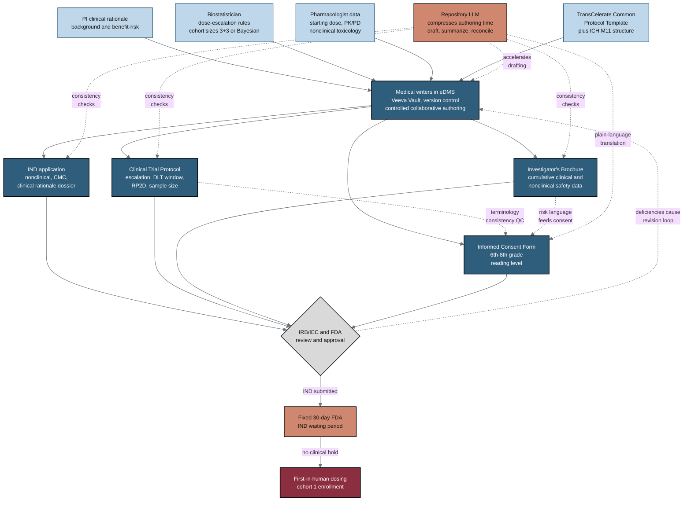

## Figure 7. Pre-trial document authoring by PI and medical writers

**Caption.** This flowchart traces pre-trial document authoring for a Phase 1 pancreatic cancer study, from controlled inputs (PI clinical rationale, biostatistician dose-escalation rules and cohort sizes, pharmacologist data, and the TransCelerate Common Protocol Template) through medical writers working in a version-controlled eDMS such as Veeva Vault. The writers compile the IND application, Clinical Trial Protocol, Investigator's Brochure, and the Informed Consent Form translated to a 6th-8th grade reading level, with dashed edges showing terminology and risk-language consistency checks across documents. After IRB/IEC and FDA review, the IND triggers the fixed 30-day FDA waiting period that must elapse before first-in-human dosing, and deficiencies feed a revision loop back into the eDMS. A terracotta accent node marks where the repository LLM compresses authoring time by drafting, summarizing, reconciling terminology, and supporting plain-language translation.

**Role in the paper.** This figure appears in the Methods section to establish the regulatory baseline against which the repository LLM efficiency gains are measured, and it becomes a TikZ mermaidfig in the draft, full, and final LaTeX stages.

**Source files.** research/industry-workflow/Gemini-3-1-Pro-Workflow-2026-06-26.md (section B); research/industry-workflow/ChatGPT-5-5-Thinking-Extended-Workflow-2026-06-26.md
