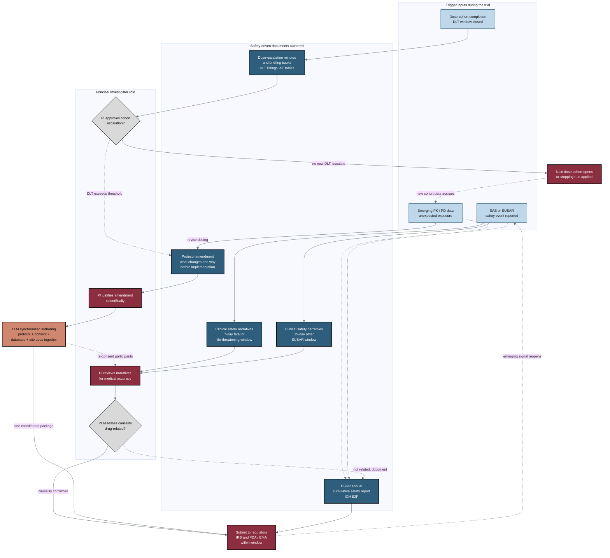

## Figure 8. During-trial document authoring driven by safety data

**Caption.** This flowchart maps during-trial document authoring that is driven by safety data in a Phase 1 pancreatic cancer trial. Trigger inputs (SAE or SUSAR events, emerging PK/PD data, and dose-cohort completion) initiate clinical safety narratives submitted within 7-day fatal or life-threatening and 15-day SUSAR windows, the annual cumulative DSUR, protocol amendments detailing what changes and why, and dose-escalation minutes with briefing books. The Principal Investigator reviews narratives for medical accuracy, assesses causality, justifies amendments scientifically, and approves cohort escalation, while the terracotta node shows the LLM authoring protocol, consent, database, and site documents together rather than sequentially. Looping edges capture how submissions and new cohort data can reopen the safety cycle.

**Role in the paper.** It appears in the Methods/Results discussion of intratrial document generation, illustrating where coordinated LLM authoring shortens enrollment pauses; in the draft, full, and final LaTeX stages it becomes a TikZ mermaidfig.

**Source files.**
- research/industry-workflow/Gemini-3-1-Pro-Workflow-2026-06-26.md (section C: safety narratives and SUSARs, DSUR, protocol amendments, dose-escalation meeting minutes)
- research/document-types/ChatGPT-5-5-Thinking-Extended-DocTypes-2026-06-26.md (protocol amendments and synchronized consent/site updates, responding to a new safety signal)
