## Figure 9. After-trial document authoring after database lock

```mermaid
%%{init: {'theme':'base','themeVariables':{'fontSize':'12px','lineColor':'#6C757D'}}}%%
flowchart LR
    LOCK["Database LOCK<br/>Locked EDC data<br/>SDV complete, no edits"]:::goal

    SRC["Source: locked EDC<br/>Medidata Rave / Oracle<br/>eCRF, PK/PD, AE logs"]:::input

    TLF["Biostatisticians<br/>Generate TLFs<br/>Tables, Listings, Figures"]:::proc

    WRITE["Medical writers<br/>Draft narrative text<br/>Interpret TLFs"]:::proc

    EFF["Efficacy results<br/>Objective response rate<br/>RECIST endpoints"]:::ctx
    SAF["Safety results<br/>CTCAE grading, DLTs<br/>AE summaries"]:::ctx

    CSR["Clinical Study Report<br/>per ICH E3, 1995<br/>often thousands of pages"]:::proc

    PI{"PI reviews<br/>and signs off<br/>clinical interpretation sound"}:::warn

    MS["Manuscripts and abstracts<br/>ASCO / ESMO<br/>per Good Publication Practice"]:::input
    LAY["Lay summaries<br/>plain-language for participants<br/>transparency regulations"]:::input

    RP2D["Phase 1-to-2 transition<br/>Establish RP2D<br/>shrinks white space"]:::accent
    PH2["Phase 2 initiation<br/>RP2D dosing cohort"]:::goal

    SRC --> TLF
    LOCK --> TLF
    TLF -->|"statistical outputs"| WRITE
    WRITE --> EFF
    WRITE --> SAF
    EFF --> CSR
    SAF --> CSR
    CSR --> PI
    PI -->|"revisions requested"| WRITE
    PI -->|"signed final CSR"| MS
    PI -->|"signed final CSR"| LAY
    PI -->|"signed final CSR"| RP2D
    RP2D -->|"feeds Phase 2 protocol"| PH2

    classDef goal   fill:#8B2E3F,stroke:#000000,stroke-width:1.5px,color:#FFFFFF
    classDef proc   fill:#2F5D7C,stroke:#000000,stroke-width:1.4px,color:#FFFFFF
    classDef accent fill:#D08770,stroke:#000000,stroke-width:1.3px,color:#111111
    classDef input  fill:#BFD7EA,stroke:#2F5D7C,stroke-width:1.2px,color:#111111
    classDef ctx    fill:#F4F7F9,stroke:#6C757D,stroke-width:1.1px,color:#111111
    classDef warn   fill:#D9D9D9,stroke:#000000,stroke-width:1.2px,color:#111111
```

**Caption.** This flowchart traces post-trial document authoring beginning at database lock, when the locked EDC data become immutable after source document verification. Biostatisticians generate Tables, Listings, and Figures (TLFs), which medical writers interpret into efficacy (objective response rate) and safety results that assemble into the Clinical Study Report (CSR) per ICH E3, a document often spanning thousands of pages. The Principal Investigator reviews and signs off, with a looping revision path back to the writers, after which the signed CSR feeds peer-reviewed manuscripts and ASCO/ESMO abstracts under Good Publication Practice, plain-language lay summaries for participants, and the Phase 1-to-2 transition that establishes the Recommended Phase 2 Dose (RP2D).

**Role in the paper.** It appears in the Methods/Results discussion of the after-trial workflow as the closing stage of trial documentation, and it becomes a TikZ mermaidfig in the draft, full, and final LaTeX stages.

**Source files.** This figure draws from:
- research/industry-workflow/Gemini-3-1-Pro-Workflow-2026-06-26.md (section D)
- research/document-types/Gemini-3-1-Pro-DocTypes-2026-06-26.md (CSR, RP2D)
