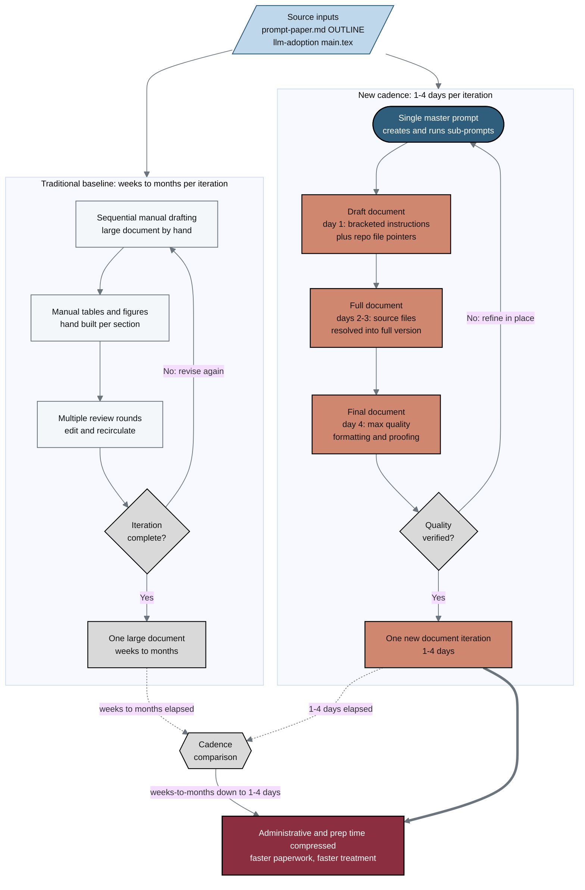

## Figure 10. New 1-4 day document iteration cadence versus the traditional baseline

**Caption.** Two-lane comparison of document iteration cadence for the Phase 1 pancreatic cancer trial. The traditional baseline lane runs sequential manual drafting, hand built tables and figures, and repeated review rounds, requiring weeks to months per large-document iteration. The new lane executes a single master prompt that produces a draft (day 1), a full version (days 2-3), and a final version (day 4), completing one new document iteration in 1-4 days. The compressed cadence feeds the patient-facing goal of reduced administrative and preparation time, supporting faster paperwork and faster treatment.

**Role in the paper.** This figure appears in Results and Discussion as the quantitative contrast motivating the single-prompt mermaid-draft-full-final workflow, and it becomes a TikZ mermaidfig in the draft, full, and final LaTeX stages.

**Source files.** 
- prompts/prompt-paper.md (OUTLINE: New Document Iterations 1-4 Days; Single Prompt: Draft to Full to Final; Mechanisms Compresses Administrative/Prep Time)
- inputs/llm-adoption/main.tex (single-prompt draft, full, final document generation with sub-prompts)
