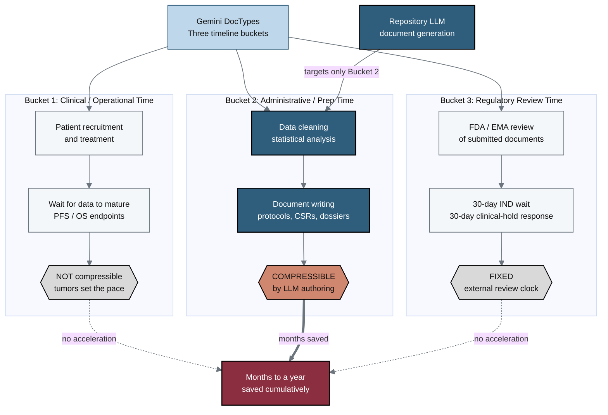

## Figure 11. Three timeline buckets and where compression occurs

**Caption.** The oncology trial timeline divides into three buckets, only one of which compresses through faster authoring. Bucket 1 (clinical/operational time: recruitment, treatment, and waiting for progression-free or overall survival data to mature) is not compressible, and Bucket 3 (regulatory review time, including the fixed 30-day IND waiting period and the 30-day clinical-hold response review) is fixed by external review clocks. The Repository LLM points only at Bucket 2 (data cleaning, statistical analysis, and document writing), the administrative/prep time that is compressible, yielding months to a year saved cumulatively across the program.

**Role in the paper.** It appears in the Discussion to scope where LLM-accelerated document generation can and cannot shorten timelines, and it becomes a TikZ mermaidfig in the draft, full, and final LaTeX stages.

**Source files.** research/document-types/Gemini-3-1-Pro-DocTypes-2026-06-26.md (three buckets); research/document-types/ChatGPT-5-5-Thinking-Extended-DocTypes-2026-06-26.md
