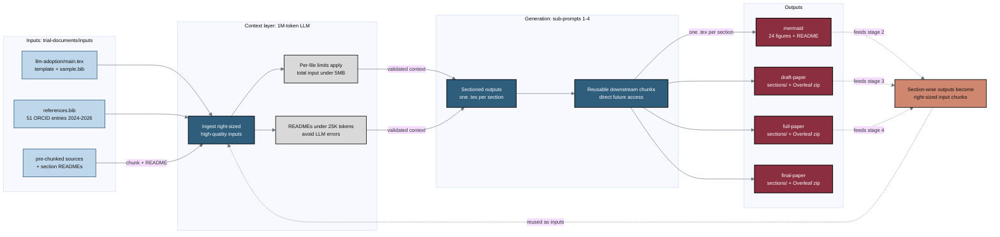

## Figure 12. Repository-based LLM document-generation architecture

**Caption.** This architecture shows how a single repository directory, trial-documents/inputs, supplies the llm-adoption template, references.bib (51 ORCID entries), and pre-chunked sources with section READMEs to a 1M-token context LLM. The context layer ingests appropriately sized, high-quality inputs under the practical bounds of total input below 5MB and READMEs below 25K tokens, then sub-prompts produce sectioned outputs of one .tex file per section for downstream reuse. Generation yields four output stages (mermaid, draft-paper, full-paper, final-paper), each emitting a sections/ directory and an Overleaf zip bundle. The looping accent edge captures how section-wise outputs serve as right-sized chunks that re-enter the context layer for future builds.

**Role in the paper.** It appears in the Methods section as the architectural overview of the repository-based generation pipeline, and it becomes a TikZ mermaidfig in the draft, full, and final LaTeX stages.

**Source files.**
- inputs/llm-adoption/main.tex (&sect; Repository Setup; &sect; LLM Limitations)
- inputs/references.bib
