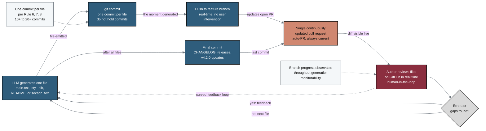

## Figure 13. Real-time auto-commit and auto-PR monitorability loop

**Caption.** This loop shows the real-time auto-commit and auto-PR process that keeps the human author in the loop throughout an extensive LLM generation. As each file is generated (main.tex, .sty, .bib, README, or a per-section .tex), the LLM issues exactly one commit, pushes it to the feature branch the moment it is generated, and updates a single continuously open pull request rather than holding commits from GitHub. The author reviews the live diff on GitHub and feeds corrections back into generation (curved feedback edge), and a single final commit delivers the CHANGELOG, releases, and v4.2.0 repository updates per Rule 6, Rule 7, and Rule 8.

**Role in the paper.** It appears in the Methods/Discussion sections describing human-in-the-loop monitorability and observability, and it becomes a TikZ mermaidfig in the draft, full, and final LaTeX stages.

**Source files.**
- prompts/prompt-paper.md (auto-commit / auto-PR process; do not hold commits; one commit per file per Rules 6, 7, 8)
- inputs/llm-adoption/main.tex (human-in-the-loop monitorability and observability via continual push to GitHub)
