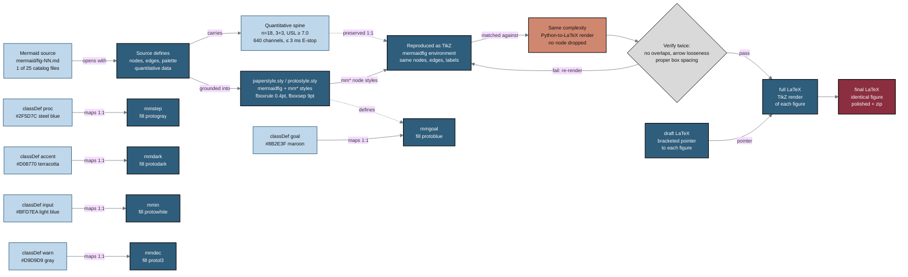

## Figure 14. Figure grounding: Mermaid reproduced as identical TikZ

**Caption.** Grounding pipeline that turns each of the 25 GitHub-rendered Mermaid sources in mermaid/fig-NN.md into an identical TikZ figure: the source defines nodes, edges, palette, and quantitative data (n=18, 3+3 escalation, USL &ge; 7.0, 640 sensor channels, &le; 3 ms E-stop), which are reproduced in the mermaidfig environment of paperstyle.sty / protostyle.sty using the mm* node styles. A warn gate verifies twice for no text-box overlaps, correct curved-arrow looseness, and proper box spacing, looping back to re-render on failure; the accent node asserts the same-complexity Python-to-LaTeX render drops no node. The five-color block shows the classDef roles mapping one-to-one onto mmgoal, mmstep, mmdark, mmin, and mmdec.

**Role in the paper.** Appears in the Methods as the figure-grounding contract for the visual artifacts, documenting how every Mermaid source becomes a TikZ mermaidfig across the draft, full, and final LaTeX stages.

**Source files.** `mermaid/*` (the 25 fig-NN.md sources, README.md classDef-to-mm* mapping table, and output-mermaid.md narrative); `trial-protocol/final-protocol/publication/protostyle.sty` (the `mermaidfig` environment and the `mmgoal`, `mmstep`, `mmdark`, `mmin`, `mmdec` node styles).
