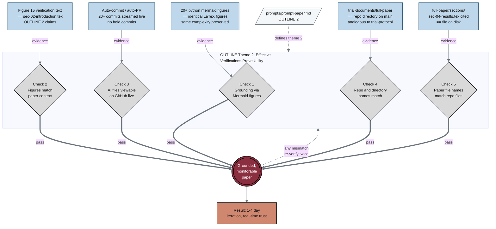

## Figure 15. Five name-matching verifications for monitorability

**Caption.** This checklist shows the five name-matching and grounding verifications that establish a monitorable, trustworthy paper: (1) grounding through Mermaid figures, (2) figures matching paper context, (3) AI-generated files viewable on GitHub in real time, (4) paper repository and directory names matching the actual repository, and (5) paper file names matching repository file names. Each warn-class check (gray diamond) is supplied with a concrete input example, such as "full-paper/sections/sec-04-results.tex cited in text == file on disk", and each passing check feeds the maroon goal node "Grounded, monitorable paper". A looping edge returns control to the checklist whenever any mismatch is detected, enforcing the prompt directive to re-verify twice, while the terminal terracotta node ties successful verification to 1-4 day iteration and real-time reviewer trust.

**Role in the paper.** It appears in the Methods/Results section as the verification framework for OUTLINE theme 2 ("Effective Verifications Prove Utility"), and it becomes a TikZ mermaidfig in the draft, full, and final LaTeX stages.

**Source files.**
- prompts/prompt-paper.md (OUTLINE 2: Effective Verifications Prove Utility)
