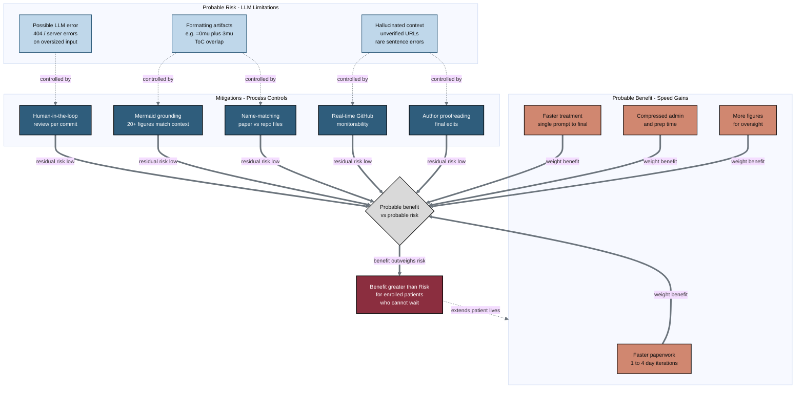

## Figure 16. Probable benefit greater than probable risk for faster administration

**Caption.** This balance figure weighs the probable risks of repository-based LLM document generation (possible LLM or server errors, formatting artifacts, and hallucinated context) against the probable benefits of faster administration (faster paperwork at 1 to 4 day iterations, faster treatment via single-prompt draft-to-full-to-final outputs, compressed administrative and preparation time, and more figures for oversight). Each risk is reduced to low residual risk by a process control: human-in-the-loop review, mermaid grounding against paper context, paper-to-repository name-matching verification, real-time GitHub monitorability, and author proofreading. The central decision diamond integrates mitigated risk and weighted benefit, and the looping edge back to the benefits subgraph reinforces that realized speed gains extend patient lives. The conclusion is that probable benefit outweighs probable risk for enrolled patients who cannot wait.

**Role in the paper.** It appears in the Discussion as the concluding argument for OUTLINE theme 3 (Probable Benefit greater than Probable Risk), and it becomes a TikZ mermaidfig across the draft, full, and final LaTeX stages.

**Source files.**
- prompts/prompt-paper.md (OUTLINE 3: Probable Benefit greater than Probable Risk)
- inputs/llm-adoption/main.tex (LLM Limitations)
