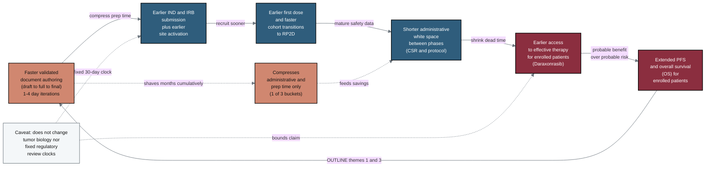

## Figure 17. Patient time-saved cascade extends PFS and OS

**Caption.** This causal cascade traces how faster validated document authoring (1-4 day draft-to-full-to-final iterations) propagates into earlier IND/IRB submission and site activation, earlier first dose with faster cohort transitions to the recommended Phase 2 dose, and shorter administrative white space between phases. These compressions deliver earlier patient access to effective therapy (Daraxonrasib) and thereby extend progression-free survival (PFS) and overall survival (OS) for enrolled patients. The dashed branch isolates the mechanism to the administrative and prep-time bucket, which can cumulatively shave months from the timeline, while the near-white caveat node bounds the claim: acceleration does not alter tumor biology or the fixed 30-day regulatory review clock. The looping edge back to authoring marks this as OUTLINE themes 1 and 3, where probable benefit exceeds probable risk.

**Role in the paper.** It appears in Discussion as the mechanistic argument that compressed administrative time yields patient survival benefit, and it becomes a TikZ mermaidfig in the draft, full, and final LaTeX stages.

**Source files.**
- prompts/prompt-paper.md (OUTLINE 1, 3)
- research/document-types/Gemini-3-1-Pro-DocTypes-2026-06-26.md (white space)
