## Figure 18. Paper section architecture mapped to .tex files

```mermaid
%%{init: {'theme':'base','themeVariables':{'fontSize':'12px','lineColor':'#6C757D'}}}%%
flowchart TB
    ASSEMBLY["main.tex<br/>\input controls assembly<br/>11pt article, paperstyle.sty<br/>paper v1.0, repo v4.2.0"]:::proc

    subgraph FRONT["Front matter"]
        ABS["Abstract<br/>section 1 of paper body"]:::goal
        KEY["Keywords<br/>\keywords line"]:::proc
        INTRO["Introduction<br/>motivation and prior works"]:::proc
        TOC["Table of Contents<br/>placed after Introduction"]:::ctx
    end

    subgraph BODY["Body: Methods to Conclusions"]
        METH["Methods<br/>mermaid-draft-full-final"]:::proc
        RES["Results<br/>quantitative evidence"]:::proc
        DISC["Discussion<br/>benefit over risk"]:::proc
        LIM["Limitations and<br/>Future Work"]:::proc
        CONC["Conclusions<br/>patient lives extended"]:::goal
    end

    subgraph BACK["Back matter"]
        REFS["References<br/>ieeetr, \nocite{*}"]:::proc
        BM["Back Matter and CC<br/>CC BY 4.0 license"]:::ctx
    end

    F1["sec-01-abstract.tex<br/>Abstract + Keywords"]:::input
    F2["main.tex \tableofcontents<br/>ToC, after Introduction"]:::input
    F3["sec-02-introduction.tex"]:::input
    F4["sec-03-methods.tex"]:::input
    F5["sec-04-results.tex"]:::input
    F6["sec-05-discussion.tex"]:::input
    F7["sec-06-limitations.tex"]:::input
    F8["sec-07-conclusions.tex"]:::input
    F9["sec-08-references-backmatter.tex<br/>References + Back Matter + CC"]:::input

    ASSEMBLY -->|"\input sec-01"| ABS
    ABS --- KEY
    ASSEMBLY -->|"\input sec-02"| INTRO
    ASSEMBLY -->|"\tableofcontents"| TOC
    ASSEMBLY -->|"\input sec-03"| METH
    ASSEMBLY -->|"\input sec-04"| RES
    ASSEMBLY -->|"\input sec-05"| DISC
    ASSEMBLY -->|"\input sec-06"| LIM
    ASSEMBLY -->|"\input sec-07"| CONC
    ASSEMBLY -->|"\input sec-08"| REFS
    REFS --- BM

    ABS -.->|"maps to"| F1
    KEY -.->|"maps to"| F1
    TOC -.->|"maps to"| F2
    INTRO -.->|"maps to"| F3
    METH -.->|"maps to"| F4
    RES -.->|"maps to"| F5
    DISC -.->|"maps to"| F6
    LIM -.->|"maps to"| F7
    CONC -.->|"maps to"| F8
    REFS -.->|"maps to"| F9
    BM -.->|"maps to"| F9

    CONC -.->|"motivates next iteration"| ASSEMBLY

    classDef goal   fill:#8B2E3F,stroke:#000000,stroke-width:1.5px,color:#FFFFFF
    classDef proc   fill:#2F5D7C,stroke:#000000,stroke-width:1.4px,color:#FFFFFF
    classDef accent fill:#D08770,stroke:#000000,stroke-width:1.3px,color:#111111
    classDef input  fill:#BFD7EA,stroke:#2F5D7C,stroke-width:1.2px,color:#111111
    classDef ctx    fill:#F4F7F9,stroke:#6C757D,stroke-width:1.1px,color:#111111
    classDef warn   fill:#D9D9D9,stroke:#000000,stroke-width:1.2px,color:#111111
```

**Caption.** This flowchart maps the eleven logical sections of the paper (Abstract, Keywords, Introduction, Table of Contents, Methods, Results, Discussion, Limitations and Future Work, Conclusions, References, and Back Matter) onto the nine source artifacts that materialize them. The proc node main.tex drives assembly through ordered \input commands and a single \tableofcontents placed after the Introduction, and each section node carries a dashed maps-to edge to its corresponding input file. Per Rule 6 of the PAPER FORMAT, every paper section is one sections/*.tex file, with sec-01-abstract.tex holding both Abstract and Keywords and sec-08-references-backmatter.tex holding References, Back Matter, and the CC BY 4.0 license. The looping edge from Conclusions back to main.tex reflects the iterative mermaid-draft-full-final build that regenerates the assembly across stages.

**Role in the paper.** This figure appears in the Methods section as the structural map of the draft-paper LaTeX project, and it becomes a TikZ mermaidfig in the draft, full, and final LaTeX stages.

**Source files.**
- prompts/prompt-paper.md (PAPER FORMAT and Rule 6 section-to-file mapping)
- draft-paper/main.tex (\input assembly order and \tableofcontents placement)
- draft-paper/sections/sec-01-abstract.tex (Abstract + Keywords)
- draft-paper/sections/sec-02-introduction.tex (Introduction)
- draft-paper/sections/sec-03-methods.tex (Methods)
- draft-paper/sections/sec-04-results.tex (Results)
- draft-paper/sections/sec-05-discussion.tex (Discussion)
- draft-paper/sections/sec-06-limitations.tex (Limitations and Future Work)
- draft-paper/sections/sec-07-conclusions.tex (Conclusions)
- draft-paper/sections/sec-08-references-backmatter.tex (References + Back Matter + CC)
