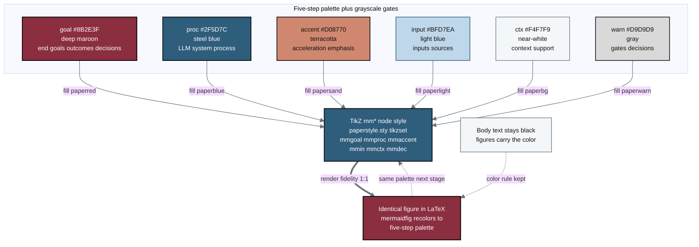

## Figure 19. Five-color palette and Mermaid-to-TikZ fidelity scheme

**Caption.** The legend defines the six fill classes used across every figure in the paper: goal (#8B2E3F deep maroon) for end goals, outcomes, and decisions; proc (#2F5D7C steel blue) for LLM, system, and process nodes; accent (#D08770 terracotta) for acceleration and emphasis; input (#BFD7EA light blue) for inputs and source files; ctx (#F4F7F9 near-white) for context and support; and warn (#D9D9D9 gray) for gates and decision diamonds. Each class maps by a labeled edge to the matching TikZ mm* node style in paperstyle.sty (mmgoal, mmproc, mmaccent, mmin, mmctx, mmdec), which in turn produces an identical figure in LaTeX through the mermaidfig environment. White text reads on the maroon and steel-blue fills while dark text reads on the light fills, and the looping edge shows the same palette being reused at each subsequent draft-full-final stage.

**Role in the paper.** This figure appears in the Methods section as the rendering and styling key for all other figures, and it becomes a TikZ mermaidfig in the draft, full, and final LaTeX stages so the GitHub-rendered Mermaid and the compiled paper carry the same colors.

**Source files.**
- prompts/prompt-paper.md (the 5 color scheme: #D08770, #8B2E3F, #2F5D7C, #BFD7EA, #F4F7F9 plus grayscale, with black body text kept)
- paperstyle.sty (the mm* TikZ node styles: mmgoal, mmproc, mmaccent, mmin, mmctx, mmdec, and the mermaidfig environment)
