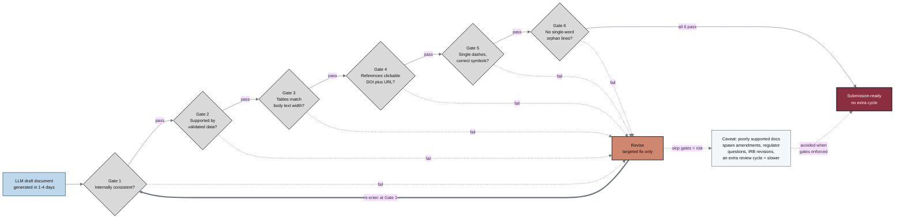

## Figure 20. Document quality gates that prevent rework cycles

**Caption.** An LLM-generated draft (produced in 1 to 4 days) passes left to right through six verification gates: internal consistency, support by validated data, tables matching body-text width, references clickable with both DOI and URL, single dashes with correct symbols (for example &sect;), and no single-word orphan lines. Passing all six gates routes the document to the maroon goal node "Submission-ready, no extra cycle," while any failure routes it through the terracotta "Revise" node and loops it back to re-enter at Gate 1 with a targeted fix. The near-white context note records the quality caveat that poorly supported or inconsistent documents make the program slower by generating amendments, regulator questions, IRB revisions, and an additional review cycle.

**Role in the paper.** This figure appears in the Methods section as the document quality-control workflow and later becomes a TikZ mermaidfig in the draft, full, and final LaTeX paper stages.

**Source files.**
- trial-documents/research/document-types/ChatGPT-5-5-Thinking-Extended-DocTypes-2026-06-26.md (quality caveat: poorly supported documents generate amendments, regulator questions, IRB revisions, and an extra review cycle)
- trial-documents/prompts/prompt-paper.md (formatting rules: clickable DOI plus URL references, body-width tables, single dashes, symbol correction such as &sect;, no single-word or two-word orphan lines)
