## Figure 21. Real-world daraxonrasib PDAC trial document thread

```mermaid
%%{init: {'theme':'base','themeVariables':{'fontSize':'12px','lineColor':'#6C757D'}}}%%
flowchart LR
    PT["KRAS-mutated PDAC patient<br/>ECOG 0-1, resectable to<br/>borderline-resectable"]:::goal
    DRUG["daraxonrasib (RMC-6236)<br/>RAS(ON) multi-selective inhibitor<br/>+ LLM-directed robotic Whipple"]:::input

    P1["Phase 1 combined IND/IDE protocol<br/>21 CFR 312 + 812 + Subpart J<br/>first-in-human, single-arm<br/>(cite trial-protocol)"]:::proc
    ESC["3+3 dose escalation<br/>+ cohort-review packages<br/>160 / 220 / 300 mg levels<br/>establishes RP2D 300 mg QD"]:::proc
    AMD["Protocol amendments<br/>+ synchronized informed consent<br/>across drug and device arms"]:::proc
    CSR["Phase 1-to-2 CSR<br/>+ EOP2 FDA briefing book<br/>safety, feasibility, RP2D handoff"]:::proc

    P2["Phase 2 randomized protocol<br/>multicenter, 8 centers, 1:1<br/>n=220 (110/arm), PFS HR 0.60<br/>(cite trial-phase-2)"]:::goal

    WF["Single-prompt workflow<br/>mermaid -> draft -> full -> final<br/>one commit per file"]:::accent

    PT -->|indication and consent| DRUG
    DRUG -->|investigational combination| P1
    P1 -->|dose finding| ESC
    ESC -->|RP2D fixed at 300 mg| AMD
    AMD -->|locked dose and consent| CSR
    CSR -->|equipoise established| P2

    WF -.->|generates| P1
    WF -.->|generates| ESC
    WF -.->|generates| AMD
    WF -.->|generates| CSR
    WF -.->|generates| P2

    P2 -.->|enrolls more| PT

    classDef goal   fill:#8B2E3F,stroke:#000000,stroke-width:1.5px,color:#FFFFFF
    classDef proc   fill:#2F5D7C,stroke:#000000,stroke-width:1.4px,color:#FFFFFF
    classDef accent fill:#D08770,stroke:#000000,stroke-width:1.3px,color:#111111
    classDef input  fill:#BFD7EA,stroke:#2F5D7C,stroke-width:1.2px,color:#111111
    classDef ctx    fill:#F4F7F9,stroke:#6C757D,stroke-width:1.1px,color:#111111
    classDef warn   fill:#D9D9D9,stroke:#000000,stroke-width:1.2px,color:#111111
```

**Caption.** This thread ties the regulated document chain of a real KRAS-mutated PDAC program to the patient it serves, tracing daraxonrasib (RMC-6236), a RAS(ON) multi-selective inhibitor, paired with LLM-directed robotic Whipple from a Phase 1 combined IND/IDE protocol through 3+3 dose escalation and cohort-review packages that fix the recommended Phase 2 dose at 300 mg once daily. Synchronized amendments and consent feed a Phase 1-to-2 clinical study report and end-of-Phase-2 briefing book, which hand off to the Phase 2 multicenter randomized protocol (8 centers, 1:1, n=220, progression-free-survival HR 0.60). The terracotta accent node marks that every one of these documents is produced by the single-prompt mermaid-draft-full-final workflow, and the looping edge back to the patient shows Phase 2 reopening enrollment.

**Role in the paper.** It appears in the Results/Discussion as the worked real-world case study that grounds the document-generation method, and it becomes a TikZ mermaidfig in the draft, full, and final LaTeX stages.

**Source files.** trial-protocol; trial-phase-2; inputs/references.bib (DARAXONRASIB: 10.5281/zenodo.20196639)
