## Figure 22. Author LLM-trust evidence timeline 2024-2026

```mermaid
%%{init: {'theme':'base','themeVariables':{'fontSize':'12px','lineColor':'#6C757D'}}}%%
flowchart LR
    M2024["2024<br/>LMM chemical and<br/>spectrometric works<br/>(Aug-Oct ChemRxiv)"]:::input
    DEC24["Dec 2024<br/>Cancer vs<br/>Conversational AI<br/>(bioRxiv 630597)"]:::proc
    PDAC25["2025 (Jun)<br/>PDAC digital-twin<br/>trial proposals<br/>(zenodo.15735068)"]:::proc
    QSP25["2025 (Aug)<br/>QSP metastatic PDAC<br/>simulation, VVUQ<br/>(zenodo.17001137)"]:::proc
    INSIL25["2025 (Jul)<br/>100k-patient in silico<br/>Phase III, 5-arm<br/>(zenodo.16415815)"]:::proc
    FDA25["2025 (Oct)<br/>FDA digital-twin<br/>compliance, PDAC<br/>(zenodo.17239510)"]:::proc
    DEC25["Dec 2025<br/>16-LLM code-gen<br/>competition, FAERS<br/>(zenodo.18029100)"]:::proc
    MAR26["Mar 2026<br/>National Platform<br/>Physical AI Trials<br/>(zenodo.19244918)"]:::goal
    CFR26["2026 (Mar)<br/>21 CFR Part 312/50<br/>adaptations<br/>(zenodo.19057628)"]:::proc
    HR26["2026 (Jun)<br/>H. R. 9510 Bill v5.0<br/>federal framework<br/>(zenodo.20619762)"]:::proc
    JUN26["Jun 2026<br/>Phase 1 and Phase 2<br/>PDAC protocols<br/>(zenodo.20780121)"]:::goal
    PAPER["This paper<br/>single-prompt LLM<br/>document generation<br/>(paper v1.0, repo v4.2.0)"]:::accent

    M2024 -->|"foundation"| DEC24
    DEC24 -->|"oncology focus"| PDAC25
    PDAC25 -->|"twin to QSP"| QSP25
    QSP25 -->|"scale up"| INSIL25
    INSIL25 -->|"regulatory align"| FDA25
    FDA25 -->|"benchmark LLMs"| DEC25
    DEC25 -->|"platformize"| MAR26
    MAR26 -->|"adapt regs"| CFR26
    CFR26 -->|"codify"| HR26
    HR26 -->|"operationalize"| JUN26
    JUN26 ==>|"trusted evidence base"| PAPER
    M2024 -.->|"document-generation lineage"| PAPER

    classDef goal   fill:#8B2E3F,stroke:#000000,stroke-width:1.5px,color:#FFFFFF
    classDef proc   fill:#2F5D7C,stroke:#000000,stroke-width:1.4px,color:#FFFFFF
    classDef accent fill:#D08770,stroke:#000000,stroke-width:1.3px,color:#111111
    classDef input  fill:#BFD7EA,stroke:#2F5D7C,stroke-width:1.2px,color:#111111
    classDef ctx    fill:#F4F7F9,stroke:#6C757D,stroke-width:1.1px,color:#111111
    classDef warn   fill:#D9D9D9,stroke:#000000,stroke-width:1.2px,color:#111111
```

**Caption.** This left-to-right timeline traces the author's 2024-2026 body of work that establishes documented trust in LLM-assisted scientific and regulatory document generation, beginning with 2024 large multimodal model chemical and spectrometric studies and Dec 2024 Cancer vs. Conversational AI, advancing through 2025 PDAC digital-twin proposals, QSP simulation, a 100,000-patient in silico Phase III, and FDA digital-twin compliance, the Dec 2025 16-LLM code-generation competition, the Mar 2026 National Platform (10.5281/zenodo.19244918), and 2026 21 CFR adaptations and H. R. 9510 Bill v5.0 (10.5281/zenodo.20619762). The Jun 2026 Phase 1 and Phase 2 PDAC protocols feed the terminal node, this single-prompt paper (paper v1.0, repo v4.2.0), with a looping dashed edge marking the continuous document-generation lineage. Each milestone is labeled with its date and Zenodo or preprint identifier so the cumulative evidence base is auditable.

**Role in the paper.** It appears in the Discussion to situate the present single-prompt generation within a verifiable record of prior author works, and it becomes a TikZ mermaidfig in the draft, full, and final LaTeX stages.

**Source files.** 
- inputs/references.bib (author works dated Aug 2024 - Jun 2026)
