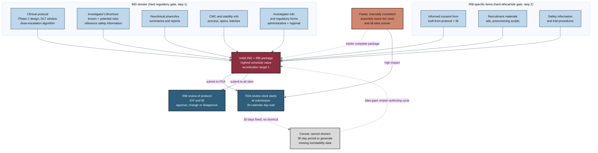

## Figure 23. Composition of the initial IND and IRB package (acceleration target 1)

**Caption.** This figure decomposes the initial IND and IRB package, the single highest-schedule-value document set, into its feeding inputs: the clinical protocol, Investigator's Brochure, nonclinical pharmacology/toxicology summaries, CMC and stability information, and investigator information with regulatory forms, plus the IRB-specific informed consent form, recruitment materials and safety information. Submission triggers two parallel gates: the 30 calendar day FDA review clock and IRB review of the protocol, ICF and IB. Faster, internally consistent assembly is high impact because it starts the FDA clock earlier and can be submitted to all sites sooner, while the looping caveat edge marks the hard limits, namely that authoring speed cannot shorten the fixed 30-day period or generate missing toxicology or stability data, and that data gaps reopen the cycle.

**Role in the paper.** It appears in the Methods/Results discussion of where faster document production has the greatest schedule value (acceleration target 1) and becomes a TikZ mermaidfig in the draft, full and final LaTeX stages.

**Source files.** research/document-types/ChatGPT-5-5-Thinking-Extended-DocTypes-2026-06-26.md (steps 1-2 and the schedule-value ranking); research/industry-workflow/ (ChatGPT-5-5-Thinking-Extended-Workflow-2026-06-26.md initial IND/CTA dossier and core clinical document sections, Gemini-3-1-Pro-Workflow-2026-06-26.md, prompt-workflow.md).
