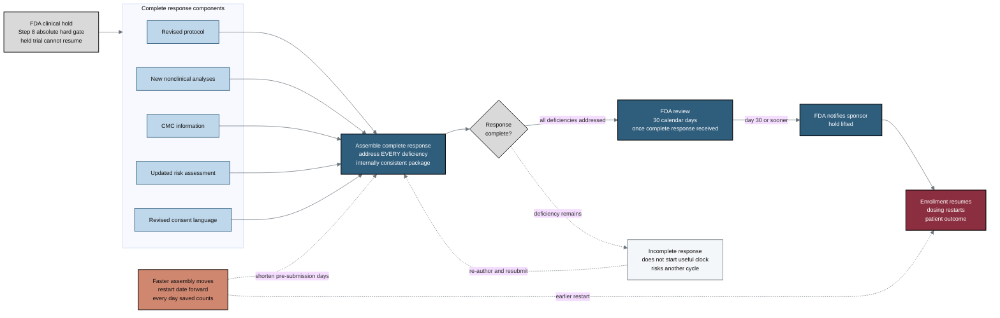

## Figure 24. Complete clinical-hold response and the 30-day review clock (acceleration target 4)

**Caption.** This flow traces the response to an FDA clinical hold (Step 8), an absolute hard gate under which a held trial cannot resume until FDA notifies the sponsor. A complete response must address every deficiency, assembling a revised protocol, new nonclinical analyses, CMC information, an updated risk assessment, and revised consent language into one internally consistent package. Once FDA receives a complete response, the agency reviews it within 30 calendar days, after which the hold is lifted and enrollment resumes. The looping caveat path shows that an incomplete response does not start the useful review clock and risks another cycle, while faster pre-submission assembly moves the potential restart date forward.

**Role in the paper.** It appears in the Results/Discussion as the fourth acceleration target, illustrating where faster LLM document generation has the greatest schedule value, and it becomes a TikZ mermaidfig in the draft, full, and final LaTeX stages.

**Source files.** research/document-types/ChatGPT-5-5-Thinking-Extended-DocTypes-2026-06-26.md (step 8 clinical hold)
