# trial-documents/sub-prompts - Generated stage sub-prompts (Process A)

This directory holds the four stage sub-prompts that **Process A** generated from
the single master prompt in [`../prompts/prompt-paper.md`](../prompts/prompt-paper.md).
**Process B** then executes them in order, growing the paper from Mermaid figures
to a draft, a full, and a final LaTeX paper. The workflow is adapted from the
`trial-protocol` build (see
[`trial-protocol/sub-prompts`](../../trial-protocol/sub-prompts)).

## Contents

| File | Stage | Output directory | Target commits |
|:--|:--|:--|:--|
| [`prompt-1-mermaid.md`](prompt-1-mermaid.md) | 1 Mermaid | [`../mermaid`](../mermaid) | 24 figures + README + output |
| [`prompt-2-draft-paper.md`](prompt-2-draft-paper.md) | 2 Draft | [`../draft-paper`](../draft-paper) | 10+ |
| [`prompt-3-full-paper.md`](prompt-3-full-paper.md) | 3 Full | [`../full-paper`](../full-paper) | 10+ |
| [`prompt-4-final-paper.md`](prompt-4-final-paper.md) | 4 Final | [`../final-paper`](../final-paper) | 10+ |

## Build pipeline

```mermaid
%%{init: {'theme':'base','themeVariables':{'fontSize':'13px','lineColor':'#6C757D'}}}%%
flowchart LR
    MP["Master prompt<br/>prompts/prompt-paper.md"]:::goal
    SP["Process A<br/>generate sub-prompts 1-4"]:::proc
    S1["Stage 1 mermaid<br/>24 colored figures"]:::input
    S2["Stage 2 draft-paper<br/>scaffold + bracketed instructions"]:::input
    S3["Stage 3 full-paper<br/>prose + TikZ + tables"]:::accent
    S4["Stage 4 final-paper<br/>polished + zip"]:::goal
    MP --> SP --> S1 --> S2 --> S3 --> S4
    classDef goal   fill:#8B2E3F,stroke:#000000,stroke-width:1.5px,color:#FFFFFF
    classDef proc   fill:#2F5D7C,stroke:#000000,stroke-width:1.4px,color:#FFFFFF
    classDef accent fill:#D08770,stroke:#000000,stroke-width:1.3px,color:#111111
    classDef input  fill:#BFD7EA,stroke:#2F5D7C,stroke-width:1.2px,color:#111111
```

## Sources used (Rule 5)

| Source | Supplies |
|:--|:--|
| [`../prompts/prompt-paper.md`](../prompts/prompt-paper.md) | The master prompt that defines all four sub-prompts |
| [`../../trial-protocol/sub-prompts`](../../trial-protocol/sub-prompts) | The four-stage mermaid -> draft -> full -> final workflow pattern |
| [`../research/document-types`](../research/document-types) | Long-document decision-gate taxonomy (2 AI sources) |
| [`../research/industry-workflow`](../research/industry-workflow) | Before/during/after Phase 1 document workflow (2 AI sources) |
| [`../inputs/llm-adoption`](../inputs/llm-adoption) | The paper template and adoption-guide base |
| [`../inputs/references.bib`](../inputs/references.bib) | Author works and citations |

## License

Released under CC BY 4.0. Author: Kevin Kawchak, CEO ChemicalQDevice.
