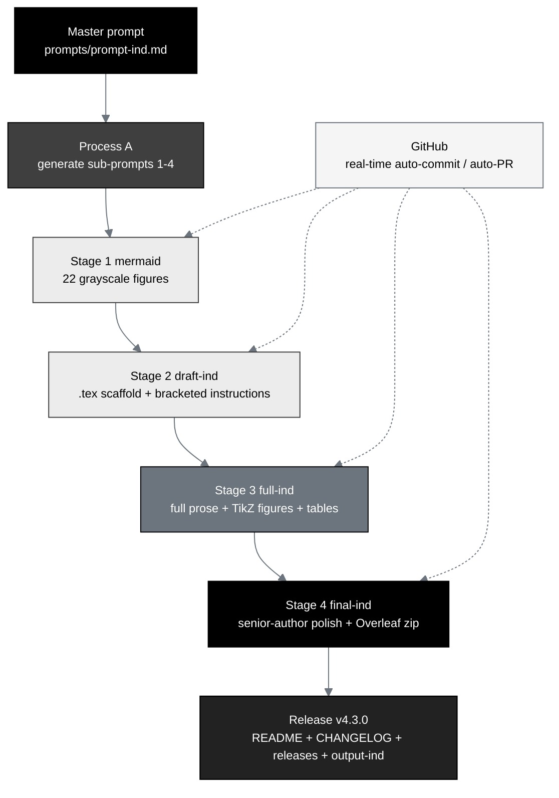

# trial-ind - Phase 1 PDAC IND: AI Generation (IND v1.0, repository v4.3.0)

[](https://creativecommons.org/licenses/by/4.0/)
[](.)
[](.)
[](.)
[](inputs/ReGARDD_IND_Template.docx)
[](mermaid)
[](sub-prompts)
[](https://orcid.org/0009-0007-5457-8667)
[](../README.md)
[](https://doi.org/10.5281/zenodo.21097442)

[Publication with Author Edits](https://github.com/kevinkawchak/physical-ai-oncology-trials/tree/main/trial-ind/final-ind/publication) (final-ind/publication). This directory builds a complete, comprehensive **Phase 1 Investigational New Drug
(IND) application** for the *LLM-Directed PDAC Robotic Daraxonrasib* trial, and at
the same time demonstrates how a repository-based large language model, driven by a
single master prompt, **hastens the entire Phase 1 IND document-package process**
while producing **22 grayscale Mermaid figures**, each from a unique perspective,
in real time. The IND follows the ReGARDD IND Table of Contents, keeps the current
paper template color (black body text), and renders every figure in a strictly
grayscale eight-tone ramp.

## What this IND is

- **Subject.** A Phase 1, first-in-human, combined IND / IDE study of on-premises
  LLM-directed eight-arm robotic pancreaticoduodenectomy (Whipple) with
  perioperative daraxonrasib (RMC-6236) in KRAS-mutated pancreatic ductal
  adenocarcinoma. The clinical content is carried from
  [`trial-protocol/final-protocol/publication`](../trial-protocol/final-protocol/publication).
- **Method.** One master prompt ([`prompts/prompt-ind.md`](prompts/prompt-ind.md))
  drives Process A (write the four stage sub-prompts) and then Process B (execute
  them as Stages 1 to 4), adapting the
  [`trial-protocol`](../trial-protocol) processing workflow.
- **Acceleration argument.** Built on
  [`trial-documents/final-paper/publication`](../trial-documents/final-paper/publication)
  and the PI guidance in
  [`trial-documents/inputs/llm-adoption`](../trial-documents/inputs/llm-adoption):
  faster validated authoring compresses only the administrative and preparation
  time bucket, advancing the 30-day FDA clock and earlier first dose for a
  low-survival population that cannot wait.

## Build pipeline (grayscale Mermaid)



## Milestone schedule (one pull request, updated as each lands)

| Milestone | Stage | Output directory | Status |
|:--|:--|:--|:--|
| M0 | Bootstrap (Process A) | `prompts/`, `sub-prompts/`, READMEs, `indstyle.sty` | complete |
| M1 | Stage 1 mermaid | [`mermaid/`](mermaid) | in progress |
| M2 | Stage 2 draft-ind | [`draft-ind/`](draft-ind) | pending |
| M3 | Stage 3 full-ind | [`full-ind/`](full-ind) | pending |
| M4 | Stage 4 final-ind | [`final-ind/`](final-ind) | pending |
| M5 | Release (v4.3.0) | root `README.md`, `CHANGELOG.md`, `releases.md`, `prompts/output-ind.md` | pending |

## Directory map

```
trial-ind/
  README.md                 this build hub
  prompts/                  prompt-ind.md (master, verbatim) + output-ind.md
  sub-prompts/              prompt-1-mermaid .. prompt-4-final-ind (Process A)
  mermaid/        (Stage 1) 22 grayscale Mermaid figure files + README + output
  draft-ind/      (Stage 2) main.tex, indstyle.sty, references.bib, sections/, zip
  full-ind/       (Stage 3) same set, fully rendered with TikZ figures + tables
  final-ind/      (Stage 4) same set, senior-author polished (no publication subdir)
  inputs/                   ReGARDD IND template, FDA 1571 instructions, ReGARDD guidance, references.bib
```

## IND Table of Contents (ReGARDD) - one `sections/*.tex` per item (Rule 6)

| `.tex` section | IND TOC item |
|:--|:--|
| `sec-00-cover-letter` | Cover Letter (precedes the FDA forms and the TOC) |
| `sec-01-fda-forms` | 1. FDA Forms 1571 and 3674 |
| `sec-02-introduction` | 3. Introduction (3.1 - 3.5) |
| `sec-03-general-investigational-plan` | 4. General Investigational Plan (4.1 - 4.7) |
| `sec-04-investigator-brochure` | 5. Investigator Brochure |
| `sec-05-proposed-clinical-research` | 6. Proposed Clinical Research (6.1 - 6.3) |
| `sec-06-cmc` | 7. Chemistry, Manufacturing and Control (7.1 - 7.2) |
| `sec-07-pharmacology-toxicology` | 8. Pharmacology and Toxicology (8.1) |
| `sec-08-previous-human-experience` | 9. Previous Human Experience (9.1 - 9.4) |
| `sec-09-additional-information` | 10. Additional Information (10.1 - 10.5) |
| `sec-10-relevant-information` | 11. Relevant Information |
| `sec-11-references-backmatter` | References and Back Matter |

## Color scheme (grayscale figures, black body text)

| Role | `classDef` / `mm*` | Tone |
|:--|:--|:--|
| End goal, decision, outcome | `goal` / `mmgoal` | `#000000` |
| LLM / process / system | `proc` / `mmproc` | `#3F3F3F` |
| Acceleration / emphasis | `accent` / `mmaccent` | `#6C757D` |
| Secondary process | `step` / `mmstep` | `#9AA0A6` |
| Input / source file | `input` / `mmin` | `#ECECEC` |
| Context / support | `ctx` / `mmctx` | `#F5F5F5` |
| Decision / gate | `dec` / `mmdec` | `#D9D9D9` |
| Rules / raw data / audit | `dark` / `mmdark` | `#222222` |

## Sources used (Rule 5)

| Source | Used for |
|:--|:--|
| [`inputs/ReGARDD_IND_Template.docx`](inputs/ReGARDD_IND_Template.docx) | IND Table of Contents, section order, Cover Letter / 1571 placement |
| [`inputs/FDA-1571_Instructions_R14_03-21-2023.md`](inputs/FDA-1571_Instructions_R14_03-21-2023.md) | FDA Form 1571 / 3674 fields and serial logic |
| [`inputs/ReGARDD-Regulatory-Guidance-for-Academic-Research-of-Drugs-and-Devices.md`](inputs/ReGARDD-Regulatory-Guidance-for-Academic-Research-of-Drugs-and-Devices.md) | academic sponsor-investigator IND guidance |
| [`inputs/references.bib`](inputs/references.bib) | citations (52 entries, extended per stage) |
| [`../trial-protocol/final-protocol/publication`](../trial-protocol/final-protocol/publication) | clinical content, quantitative tables, formatting methods |
| [`../trial-documents/final-paper/publication`](../trial-documents/final-paper/publication) | acceleration argument, adapted figure context, back matter |
| [`../trial-documents/inputs/llm-adoption`](../trial-documents/inputs/llm-adoption) | PI large-document authoring guidance |
| [`../regulatory/Adaption-21-CFR-Part-312/source/Physical_AI_21_CFR_Part_312.sty`](../regulatory/Adaption-21-CFR-Part-312/source/Physical_AI_21_CFR_Part_312.sty) | the paper template `indstyle.sty` adapts |

## Disclaimer

This is an independent research paper and practical adoption guide. It is not
medical or regulatory advice and is not endorsed by the FDA, NIH, HHS, an IRB,
ICH, or any sponsor. All figures derive from the author's repository sources and
are illustrative unless tied to a cited reference. This work was adapted using
Claude Code Opus 4.8. The DOI `10.5281/zenodo.xxxxxxxx` is a placeholder pending
deposit.

## License

Creative Commons Attribution 4.0 International (CC BY 4.0).
