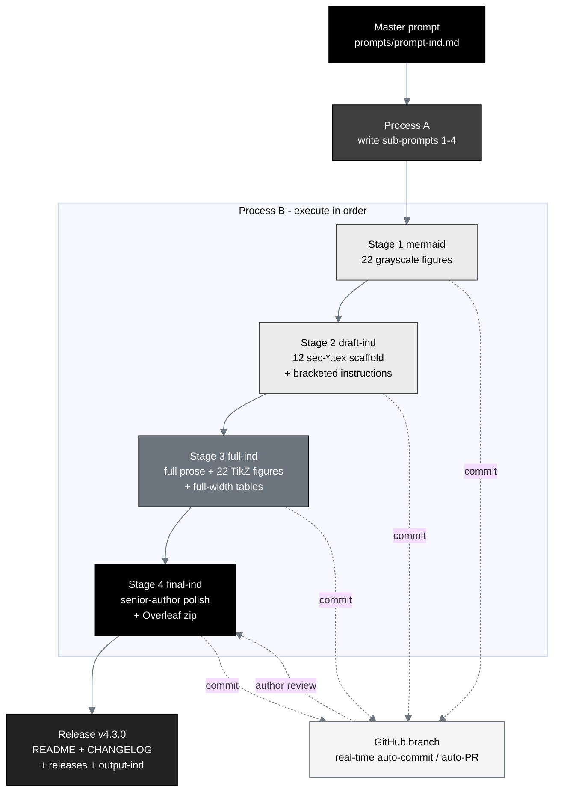

## Figure 1. The single-prompt IND build pipeline

**Caption.** The single-prompt mermaid to draft to full to final build pipeline for
the Phase 1 PDAC IND. One master prompt drives Process A (write the four
sub-prompts) and then Process B (execute them as Stages 1 to 4). Dashed edges show
that every generated file is committed and pushed to one continuously updated pull
request in real time, and the curved feedback edge shows author review returning
into the final stage, all without manual intervention.

**Role in the IND.** Renders as the opening process figure in the Introduction
(§3.1), establishing how the IND package is assembled and monitored.

**Source files.** `trial-ind/prompts/prompt-ind.md` (master prompt);
`trial-ind/sub-prompts/prompt-1-mermaid.md .. prompt-4-final-ind.md` (the four
stages); `trial-documents/final-paper/publication/sections/sec-03-methods.tex`
(the single-prompt method adapted in context, not copied).
