## Figure 2. ReGARDD IND Table-of-Contents architecture

```mermaid
%%{init: {'theme':'base','themeVariables':{'fontSize':'11px','lineColor':'#6C757D'}}}%%
flowchart LR
    CL["Cover Letter<br/>sec-00"]:::accent
    F["1. FDA Forms 1571 / 3674<br/>sec-01"]:::proc
    TOC["2. Table of Contents<br/>generated"]:::ctx
    I["3. Introduction<br/>sec-02 (3.1-3.5)"]:::input
    GIP["4. General Investigational Plan<br/>sec-03 (4.1-4.7)"]:::input
    IB["5. Investigator Brochure<br/>sec-04"]:::input
    PCR["6. Proposed Clinical Research<br/>sec-05 (6.1-6.3)"]:::input
    CMC["7. Chemistry, Manufacturing, Control<br/>sec-06 (7.1-7.2)"]:::input
    PT["8. Pharmacology / Toxicology<br/>sec-07 (8.1)"]:::input
    PHE["9. Previous Human Experience<br/>sec-08 (9.1-9.4)"]:::input
    AI["10. Additional Information<br/>sec-09 (10.1-10.5)"]:::input
    RI["11. Relevant Information<br/>sec-10"]:::input
    BM["References + Back Matter<br/>sec-11"]:::goal
    MAIN["main.tex<br/>assembles all"]:::goal
    CL --> F --> TOC --> I --> GIP --> IB --> PCR --> CMC --> PT --> PHE --> AI --> RI --> BM
    MAIN -.input.-> CL
    MAIN -.input.-> TOC
    MAIN -.input.-> BM
    classDef goal fill:#000000,stroke:#000000,stroke-width:1.5px,color:#FFFFFF
    classDef proc fill:#3F3F3F,stroke:#000000,stroke-width:1px,color:#FFFFFF
    classDef accent fill:#6C757D,stroke:#000000,stroke-width:1px,color:#FFFFFF
    classDef input fill:#ECECEC,stroke:#3F3F3F,stroke-width:1px,color:#000000
    classDef ctx fill:#F5F5F5,stroke:#6C757D,stroke-width:1px,color:#000000
```

**Caption.** The ReGARDD IND Table of Contents reproduced as the file architecture
of the build. The Cover Letter and the FDA Forms 1571 and 3674 precede the
generated Table of Contents; the eleven numbered IND sections and the References
and Back Matter each become exactly one `sections/sec-*.tex` file assembled by
`main.tex`, so the document structure and the repository structure match
one-to-one (Rule 6).

**Role in the IND.** Renders in the Introduction (§3.1) as the navigation map of
the submission and as the in-document evidence that the ReGARDD TOC format is
followed throughout.

**Source files.** `trial-ind/inputs/ReGARDD_IND_Template.docx` (the canonical TOC
and section order); `trial-ind/draft-ind/main.tex` (the `\input` assembly);
`trial-documents/final-paper/publication/sections/sec-03-methods.tex` (the
one-section-per-file convention adapted in context).
