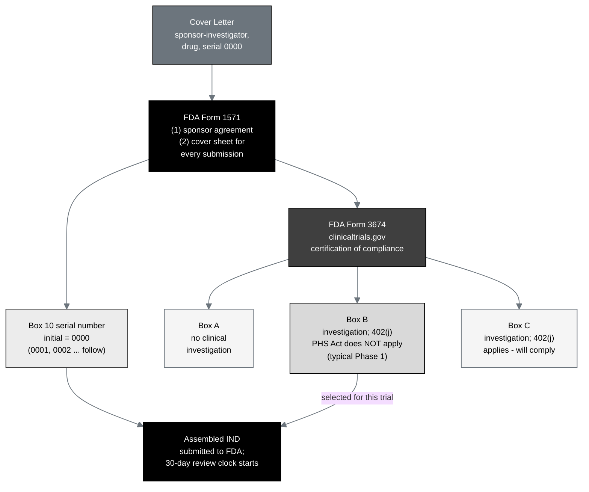

## Figure 3. Cover Letter, FDA Form 1571, and Form 3674 cover-sheet flow

**Caption.** The Cover Letter, FDA Form 1571, and FDA Form 3674 cover-sheet flow.
Form 1571 serves the dual purpose of a sponsor-investigator agreement and a cover
sheet for every submission; the initial serial number in box 10 is 0000. Form
3674 certifies clinicaltrials.gov compliance: Box A (no clinical investigation),
Box B (an investigation to which 42 U.S.C. §282(j) / section 402(j) of the PHS Act
does not apply, the typical Phase 1 selection), or Box C (the requirements apply).
The Cover Letter and the FDA forms precede the Table of Contents.

**Role in the IND.** Renders in §1 (FDA Forms 1571 and 3674), documenting the
cover-sheet logic and the serial / certification selections for this initial
submission.

**Source files.** `trial-ind/inputs/FDA-1571_Instructions_R14_03-21-2023.md`
(1571 fields, serial logic); `trial-ind/inputs/ReGARDD_IND_Template.docx` (the
3674 Box A / B / C guidance and the Cover Letter placement rule).
