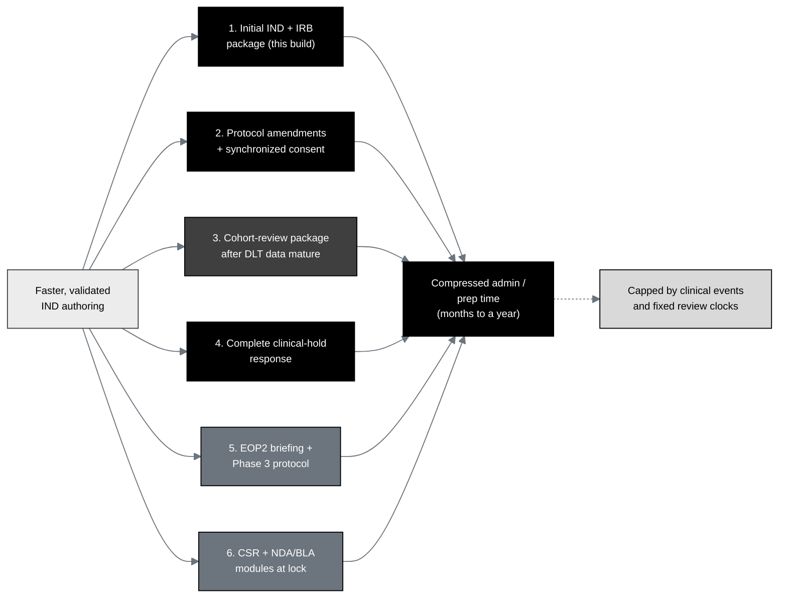

## Figure 4. The six greatest-acceleration IND document targets

**Caption.** The six greatest-acceleration document targets, ranked, with the
**initial IND and IRB package the highest-value target and the subject of this
build**. One input, faster validated authoring, feeds all six; each contributes to
a common compression of administrative and preparation time of months to a year.
The schedule value is highest on the critical path, and the gains are capped by
clinical events and fixed review clocks (they cannot shorten the 30-day FDA review
or manufacture missing data).

**Role in the IND.** Renders in the Introduction (§3.1) and the General
Investigational Plan (§4.1 Rationale), situating the IND as target one and framing
the acceleration claim.

**Source files.**
`trial-documents/final-paper/publication/sections/sec-04-results.tex` (Figure 16,
the six targets, adapted in context to the IND);
`trial-documents/final-paper/publication/sections/sec-05-discussion.tex`
(critical-path and cap argument).
