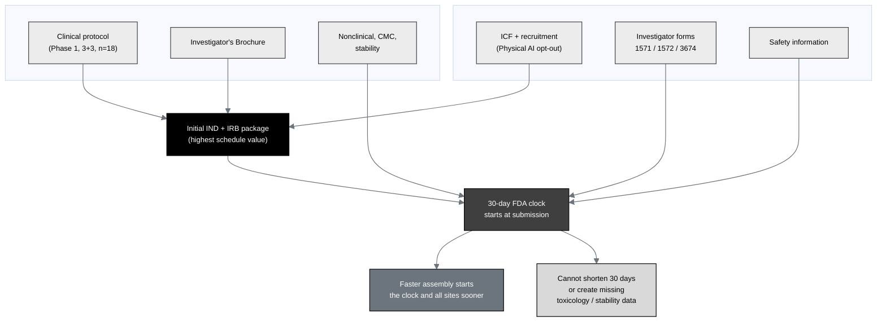

## Figure 5. Composition of the initial IND and IRB package

**Caption.** Composition of the initial IND and IRB package. The clinical
protocol, Investigator's Brochure, nonclinical / CMC / stability data, informed
consent and recruitment materials, investigator forms (1571, 1572, 3674), and
safety information are assembled into one internally consistent package. Faster,
internally consistent assembly starts the 30-day FDA clock and all sites sooner
but cannot shorten the fixed period or generate missing toxicology or stability
data.

**Role in the IND.** Renders in §6 (Proposed Clinical Research) and the
Introduction, itemizing the package the submission comprises.

**Source files.**
`trial-documents/final-paper/publication/sections/sec-04-results.tex` (Figure 17,
adapted in context to this IND);
`trial-protocol/final-protocol/publication/sections/sec-01-summary.tex` (the
protocol, IB, and consent components).
