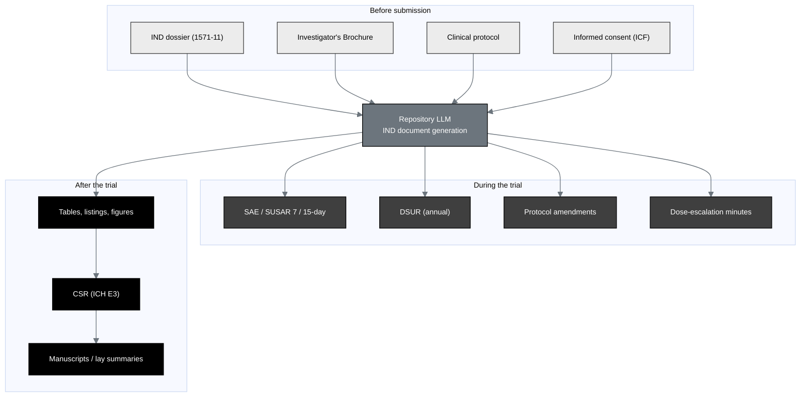

## Figure 6. The Phase 1 IND document landscape: before, during, and after submission

**Caption.** The large Phase 1 oncology document landscape around the IND, grouped
into before-submission inputs (the IND dossier, Investigator's Brochure, protocol,
and consent), during-trial process documents (7 and 15-day safety reports, the
annual DSUR, amendments, and dose-escalation minutes), and after-trial outputs
(tables / listings / figures, the ICH E3 clinical study report, and manuscripts /
lay summaries), all generated by the repository LLM around the central hub.

**Role in the IND.** Renders in the Introduction (§3.1) to place the IND in the
full document lifecycle the same method maintains.

**Source files.**
`trial-documents/final-paper/publication/sections/sec-03-methods.tex` (Figure 6,
the before / during / after landscape, adapted in context);
`trial-protocol/final-protocol/publication/sections/sec-10-oversight.tex`
(safety-report and DSUR cadence).
