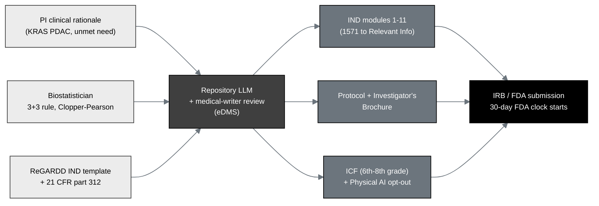

## Figure 7. Pre-submission IND authoring workflow

**Caption.** Pre-submission authoring. The principal investigator's clinical
rationale, the biostatistician's 3+3 and exact-confidence-interval rules, and the
ReGARDD IND template under 21 CFR part 312 are compiled by the repository LLM under
medical-writer review into the eleven IND modules, the protocol and Investigator's
Brochure, and the informed consent form with the Physical AI opt-out, which start
the 30-day FDA clock on submission.

**Role in the IND.** Renders in §6.1 (Study Protocol) and the Introduction,
documenting how the submission was authored.

**Source files.**
`trial-documents/final-paper/publication/sections/sec-03-methods.tex` (Figure 9,
pre-trial authoring, adapted in context);
`trial-documents/inputs/llm-adoption/main.tex` (the PI large-document guidance);
`trial-protocol/final-protocol/publication/sections/sec-09-statistics.tex` (the
3+3 and Clopper-Pearson rules).
