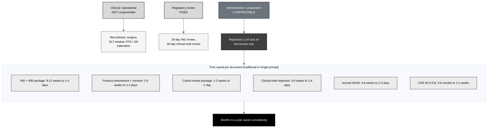

## Figure 8. The three timeline buckets, with exact time saved per IND document

**Caption.** The three timeline buckets. Only the administrative and preparation
bucket compresses; the clinical / operational bucket and the fixed regulatory
review clocks do not. The repository LLM acts on the middle bucket only. The exact
per-document savings are: initial IND and IRB package 8 to 12 weeks reduced to 1 to
4 days; protocol amendment with synchronized consent 2 to 4 weeks to 1 to 2 days;
cohort-review package 1 to 2 weeks to about 1 day; complete clinical-hold response
3 to 6 weeks to 2 to 4 days; annual DSUR 4 to 8 weeks to 2 to 3 days; clinical
study report 3 to 6 months to 1 to 2 weeks, summing to months to a year saved
cumulatively.

**Role in the IND.** Renders in the General Investigational Plan (§4.1 Rationale),
quantifying the schedule value of the method for this submission.

**Source files.**
`trial-documents/final-paper/publication/sections/sec-04-results.tex` (Figure 19,
the three buckets, adapted in context with the per-document figures);
`trial-documents/final-paper/publication/sections/sec-05-discussion.tex` (the
cumulative-savings argument).
