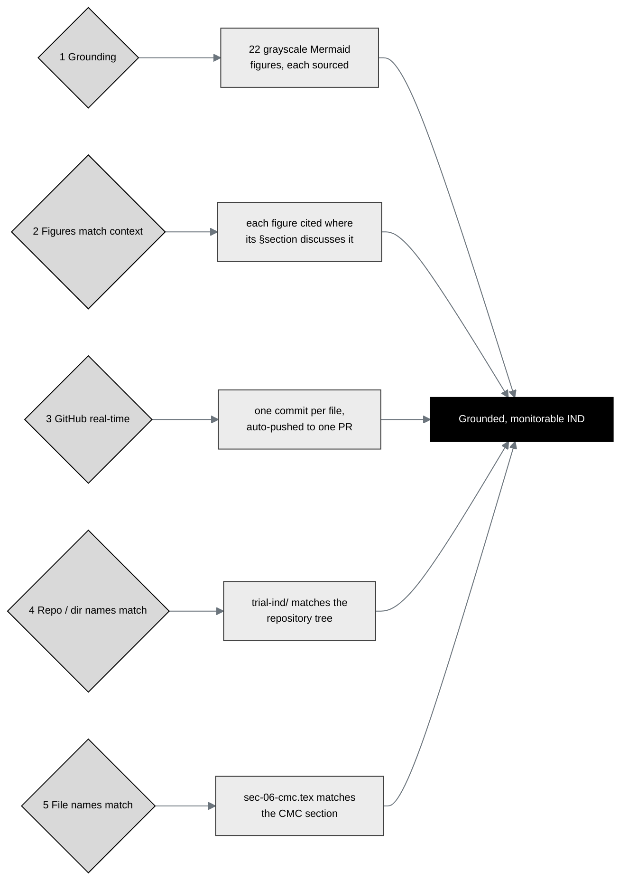

## Figure 9. Five name-matching and grounding verifications for the IND

**Caption.** Five name-matching and grounding verifications, each with a concrete
IND example: grounding (every one of the 22 grayscale figures names its source
files); figures match context (each is cited where its section discusses it);
GitHub real-time (one commit per file, auto-pushed to one continuously updated
pull request); repository and directory names match (the `trial-ind/` tree mirrors
the document structure); and file names match (for example `sec-06-cmc.tex` maps to
the Chemistry, Manufacturing and Control section). Together they yield a grounded,
monitorable IND.

**Role in the IND.** Renders in §11 (Relevant Information) as the verification
discipline the build applies, and in the Introduction.

**Source files.**
`trial-documents/final-paper/publication/sections/sec-04-results.tex` (Figure 20,
the five verifications, adapted in context with IND examples).
